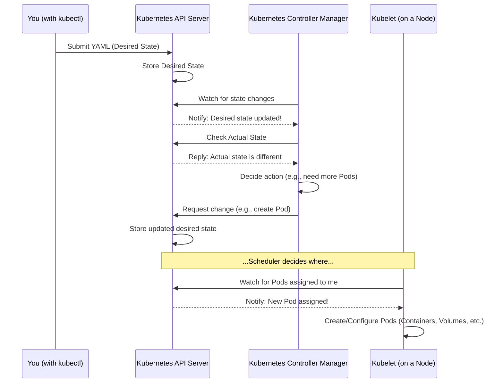

# Chapter 1: Kubernetes Configuration

Imagine you want to run a website or an application that many people can access. This usually involves several pieces working together: the application code itself, a web server (like Nginx) to handle incoming requests, maybe a way to get data *from* the application (like performance metrics), and a way to expose it to the internet. Setting all this up manually on many servers can be complicated and time-consuming!

This is where Kubernetes comes in. Kubernetes is a powerful system for automating the deployment, scaling, and management of containerized applications. But how do you *tell* Kubernetes what you want it to run and how you want it configured?

You use **Kubernetes Configuration files**. Think of these files as **blueprints** for your application environment inside the Kubernetes cluster. They describe the *desired state* of your infrastructure – what applications should run, how many copies, how they should be connected, how they should be exposed, and so on.

In the `microk8s-autoscaling` project, these configuration files (mostly written in a format called YAML) are crucial. They define everything from the Nginx web server itself to the tools that collect metrics and the rules for automatic scaling.

## What are these "Blueprint" Files Made Of?

Kubernetes configuration files are typically written in **YAML**. YAML is a human-readable data format. It's like a structured list or dictionary where you use indentation to show relationships between items.

```yaml
# This is a simple YAML example
name: MyApplication
version: "1.0"
settings:
  enabled: true
  replicas: 3
```

This simple YAML shows a structure with `name`, `version`, and `settings` which itself contains `enabled` and `replicas`.

In Kubernetes, YAML files describe **Kubernetes Resources**. A Kubernetes Resource is essentially an object in the cluster that represents a piece of your desired state. Examples include:

*   **Pods:** The smallest deployable units, containing one or more containers.
*   **Deployments:** Describe how to run a set of identical Pods (like your web server) and how to update them.
*   **Services:** Define a stable way to access a group of Pods (like giving your web servers a single internal address).
*   **Ingresses:** Manage external access to Services in a cluster (like setting up rules for traffic coming from the internet).
*   **ConfigMaps:** Store non-sensitive configuration data (like configuration files for your application).
*   **HorizontalPodAutoscalers (HPA):** Automatically scale the number of Pods in a Deployment based on observed metrics (like CPU usage).

You write YAML files that define instances of these resources, and then you give these files to Kubernetes.

## Using Blueprints to Build in Kubernetes

So, how do you use these YAML blueprints to set up your application? You use the Kubernetes command-line tool, `kubectl`. The primary command for applying configuration is `kubectl apply -f <filename>`.

When you run this command, `kubectl` sends the information from the YAML file to the Kubernetes cluster's brain (the Control Plane). Kubernetes then looks at the desired state you've defined in the file and compares it to the *current state* of the cluster. If they don't match, Kubernetes works to make the current state match the desired state.

Let's look at some simplified examples from the project's `config` and `deployments` directories to see how different parts of our Nginx application are defined using these resources.

### Defining Configuration Data with ConfigMap

Sometimes your application needs configuration files or settings. You can store these in a `ConfigMap`. This keeps your configuration separate from your application code.

Here's a snippet from `config/nginx-config.yaml`:

```yaml
apiVersion: v1 # Specifies the Kubernetes API version
kind: ConfigMap # Defines this resource as a ConfigMap
metadata: # Information about the resource
  name: nginx-config # A unique name for this ConfigMap
  namespace: default # The namespace it belongs to (default is common)
data: # The configuration data itself
  nginx.conf: | # Key-value pair, the value is the content of nginx.conf
    user nginx;
    worker_processes auto;
    error_log /var/log/nginx/error.log warn;
    pid /run/nginx.pid;
    # ... rest of nginx.conf content ...
```

This `ConfigMap` named `nginx-config` holds the content of an Nginx configuration file (`nginx.conf`). Later, we can make this content available to our Nginx application containers.

### Defining the Application and its Containers with Deployment

A `Deployment` tells Kubernetes *how* to run your application Pods. It specifies which container image to use, how many copies (replicas) you want, how to update them, and resource requirements.

Here's a snippet focusing on the Deployment part from `deployments/nginx-deployment.yaml`:

```yaml
apiVersion: apps/v1 # API version for Deployments
kind: Deployment # Resource type is Deployment
metadata: # Information about the Deployment
  name: nginx-deployment # Name of the Deployment
  namespace: default # Namespace
spec: # The desired state specification
  replicas: 1 # Start with 1 copy (Pod) of the application
  selector: # How the Deployment finds Pods it manages
    matchLabels: # Look for Pods with these labels
      app: nginx
  template: # The blueprint for the Pods created by this Deployment
    metadata: # Information about the Pods
      labels: # Labels applied to the Pods
        app: nginx
    spec: # The desired state for the Pods
      containers: # List of containers within the Pod
        - name: nginx # Name of the first container (the web server)
          image: nginx:latest # Container image to use
          ports: # Ports the container listens on
            - containerPort: 80 # Nginx default web port
          volumeMounts: # How to make data (like ConfigMap) available
            - name: nginx-config-volume # Name linking to a Volume definition
              mountPath: /etc/nginx/nginx.conf # Path inside the container
              subPath: nginx.conf # Use only the 'nginx.conf' key from the Volume
          resources: # CPU/Memory limits and requests
            requests: # What the container ideally needs
              cpu: "100m" # 100 milli-CPU
              memory: "128Mi" # 128 MebiBytes of memory
            limits: # Max resources the container can use
              cpu: "500m" # 500 milli-CPU
              memory: "256Mi" # 256 MebiBytes of memory
        - name: nginx-exporter # Name of the second container (for metrics)
          image: nginx/nginx-prometheus-exporter:latest # Image for the exporter
          args: # Arguments passed to the exporter command
            - "-nginx.scrape-uri=http://127.0.0.1/nginx_status" # Where exporter gets data
          ports: # Port the exporter listens on
            - containerPort: 9113 # Default exporter port
      volumes: # Define volumes available to containers in the Pod
        - name: nginx-config-volume # Name used in volumeMounts
          configMap: # This volume gets data from a ConfigMap
            name: nginx-config # The name of the ConfigMap to use (defined above)
```

This `Deployment` defines Pods that contain *two* containers: one running Nginx (`nginx`) and another running an Nginx Prometheus Exporter (`nginx-exporter`). Notice how the `nginx` container uses `volumeMounts` to access the configuration data stored in the `nginx-config` `ConfigMap` we saw earlier. This modular approach makes things cleaner. It also specifies resource `requests` and `limits`, which are important for scheduling and autoscaling.

### Providing Stable Access with Service

A `Service` provides a stable way to access one or more Pods, even if the Pods themselves are created or destroyed (like during updates or scaling). It acts as an internal load balancer and gives you a single IP address and DNS name inside the cluster.

Here's the Service snippet from `deployments/nginx-deployment.yaml`:

```yaml
apiVersion: v1 # API version for Services
kind: Service # Resource type is Service
metadata: # Information about the Service
  name: nginx-service # Name of the Service
  namespace: default # Namespace
  labels: # Labels for the Service itself (often match the app)
    app: nginx
spec: # The desired state specification
  selector: # How the Service finds the Pods it should send traffic to
    app: nginx # Match Pods with the label app: nginx
  ports: # Ports the Service exposes
    - name: web # Name for the web port
      port: 80 # Port the Service exposes
      targetPort: 80 # Port on the Pods to send traffic to
    - name: metrics # Name for the metrics port
      port: 9113 # Port the Service exposes for metrics
      targetPort: 9113 # Port on the Pods for metrics
  type: ClusterIP # Type of Service: internal cluster IP
```

This `Service` named `nginx-service` targets any Pods that have the label `app: nginx`. Since our `nginx-deployment` creates Pods with this label, the Service will automatically send traffic to those Pods. It exposes two ports: 80 for the web server and 9113 for the metrics exporter. `ClusterIP` means it's only reachable from *inside* the cluster.

### Exposing to the Outside World with Ingress

If you want to access your application from outside the Kubernetes cluster (e.g., from your web browser on your laptop), you often use an `Ingress`. An `Ingress` manages external access to Services in a cluster, typically providing HTTP and HTTPS routing.

Here's a snippet from `deployments/ingres.yaml`:

```yaml
apiVersion: networking.k8s.io/v1 # API version for Ingress (networking resources)
kind: Ingress # Resource type is Ingress
metadata: # Information about the Ingress
  name: nginx-ingress # Name of the Ingress
  namespace: default # Namespace
  annotations: # Extra configuration for the Ingress controller
    nginx.ingress.kubernetes.io/rewrite-target: / # Specific annotation for Nginx ingress
spec: # The desired state specification
  rules: # Rules for routing traffic
    - http: # Rules for HTTP traffic
        paths: # List of paths to match
          - path: / # Match requests starting with /
            pathType: Prefix # Match any path starting with /
            backend: # Where to send matched traffic
              service: # Send to a Service
                name: nginx-service # The name of the Service (our Nginx Service)
                port:
                  number: 80 # The port on the Service to send to
```

This `Ingress` named `nginx-ingress` tells an Ingress Controller (a special component running in the cluster) to send any incoming HTTP traffic for the root path (`/`) to the `nginx-service` on port 80. This is how traffic from outside gets routed *to* your Nginx web server Pods.

### Defining Automatic Scaling with HorizontalPodAutoscaler

Finally, to make our application automatically scale, we use a `HorizontalPodAutoscaler` (HPA). The HPA automatically increases or decreases the number of Pods in a Deployment (or other scalable resource) based on metrics like CPU utilization or custom metrics.

Here's a snippet from `simulation/hpa.yaml`:

```yaml
apiVersion: autoscaling/v2 # API version for HPA (autoscaling resources)
kind: HorizontalPodAutoscaler # Resource type is HorizontalPodAutoscaler
metadata: # Information about the HPA
  name: nginx-hpa # Name of the HPA
  namespace: default # Namespace
spec: # The desired state specification
  scaleTargetRef: # What resource to scale
    apiVersion: apps/v1 # API version of the target
    kind: Deployment # Kind of the target (our Nginx Deployment)
    name: nginx # Name of the target (Note: this refers to a resource named 'nginx', not 'nginx-deployment' as in previous examples. This might be a different Nginx setup used in simulation). Let's assume it targets the Nginx Deployment for this explanation.
  minReplicas: 1 # Minimum number of Pods to scale down to
  maxReplicas: 5 # Maximum number of Pods to scale up to
  metrics: # List of metrics to use for scaling decisions
  - type: Resource # Metric type is a built-in resource metric (CPU or Memory)
    resource: # Resource metric details
      name: cpu # Metric name is CPU
      target: # Target value for the metric
        type: Utilization # Target is based on average utilization
        averageUtilization: 70 # Scale up if average CPU utilization exceeds 70%
```

This `HorizontalPodAutoscaler` named `nginx-hpa` is configured to watch a resource named `nginx` of kind `Deployment` (in the project's simulation, this is a different deployment than `nginx-deployment`, but the *concept* of HPA applies to any Deployment). It will ensure there is at least 1 Pod (`minReplicas: 1`) and at most 5 Pods (`maxReplicas: 5`). If the average CPU utilization across all Pods it manages goes above 70%, it will tell the Deployment to increase the number of replicas. If it drops significantly below, it will decrease the replicas (but not below the minimum). This is the core mechanism for autoscaling!

## How Kubernetes Uses the Blueprints (Under the Hood - Simple View)

When you run `kubectl apply -f <filename>`, it's like handing your blueprint to the Kubernetes "construction crew".

1.  **You submit the YAML:** You tell the Kubernetes API Server (the front door of the cluster) about the desired state described in your YAML file.
2.  **API Server stores it:** The API Server saves this desired state.
3.  **Controllers notice:** Various Kubernetes controllers (like the Deployment Controller, Service Controller, HPA Controller) constantly watch the API Server for changes and compare the *desired* state to the *actual* state.
4.  **Controllers act:** If a controller sees a difference (e.g., your YAML says `replicas: 3` but there are only 2 Pods running), it takes action. The Deployment Controller might ask the Scheduler to find a place to run a new Pod. The HPA Controller might notice high CPU and update the Deployment's desired `replicas` count.
5.  **Kubelet makes it happen:** The Kubelet (an agent running on each worker node) talks to the Control Plane and makes sure the Pods defined for its node are running, configured, and healthy, matching the desired state.

Here's a very simplified sequence diagram:



This process shows that you define *what* you want (desired state), and Kubernetes constantly works to achieve that state.

## Summary of Resource Types

Here's a quick overview of the key resource types we saw and their purpose in defining our application environment:

| Resource Kind              | Purpose                                                         | Example File                 |
| :------------------------- | :-------------------------------------------------------------- | :--------------------------- |
| `ConfigMap`                | Store non-sensitive configuration data (like config files).       | `config/nginx-config.yaml`   |
| `Deployment`               | Define how to run a set of identical Pods (your application).   | `deployments/nginx-deployment.yaml` |
| `Service`                  | Provide stable access to a group of Pods within the cluster.    | `deployments/nginx-deployment.yaml` (part of) |
| `Ingress`                  | Manage external access to Services (expose to the internet).    | `deployments/ingres.yaml`    |
| `HorizontalPodAutoscaler`  | Automatically scale the number of Pods based on metrics.        | `simulation/hpa.yaml`        |

These configuration files are the foundation of running applications in Kubernetes. They are the language you use to tell the cluster what you need.

## Conclusion

In this chapter, you learned that Kubernetes configuration files, written in YAML, act as blueprints that define the desired state of your application and its supporting infrastructure within the cluster. You saw how different resource types like `ConfigMap`, `Deployment`, `Service`, `Ingress`, and `HorizontalPodAutoscaler` are used to define specific parts of the application environment, using the Nginx setup as an example.

Understanding these configuration files is the first step to working with Kubernetes. The next logical step is to understand how we can monitor the health and performance of our applications defined by these configurations. This is where we get the data needed for things like autoscaling.

In the next chapter, we'll dive into the world of [Observability & Metrics](02_observability___metrics_.md) and see how we can collect information about our running applications in Kubernetes.

[Observability & Metrics](02_observability___metrics_.md)

---

<sub><sup>Generated by [AI Codebase Knowledge Builder](https://github.com/The-Pocket/Tutorial-Codebase-Knowledge).</sup></sub> <sub><sup>**References**: [[1]](https://github.com/rohmatmret/microk8s-autoscaling/blob/ff93765af606c718dc57fc58e4284e10f9ff1560/config/nginx-config.yaml), [[2]](https://github.com/rohmatmret/microk8s-autoscaling/blob/ff93765af606c718dc57fc58e4284e10f9ff1560/deployments/ingres.yaml), [[3]](https://github.com/rohmatmret/microk8s-autoscaling/blob/ff93765af606c718dc57fc58e4284e10f9ff1560/deployments/nginx-deployment.yaml), [[4]](https://github.com/rohmatmret/microk8s-autoscaling/blob/ff93765af606c718dc57fc58e4284e10f9ff1560/simulation/hpa.yaml), [[5]](https://github.com/rohmatmret/microk8s-autoscaling/blob/ff93765af606c718dc57fc58e4284e10f9ff1560/simulation/ingress-controller-service.yaml), [[6]](https://github.com/rohmatmret/microk8s-autoscaling/blob/ff93765af606c718dc57fc58e4284e10f9ff1560/simulation/nginx-ingress.yaml), [[7]](https://github.com/rohmatmret/microk8s-autoscaling/blob/ff93765af606c718dc57fc58e4284e10f9ff1560/simulation/nginx.yaml)</sup></sub>