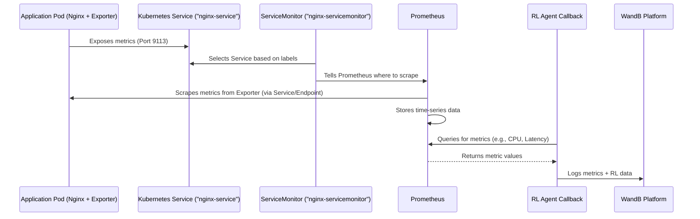

# Chapter 2: Observability & Metrics

Welcome back! In [Chapter 1: Kubernetes Configuration](01_kubernetes_configuration_.md), we learned how to use YAML files as blueprints to tell Kubernetes *what* applications and resources we want to run in our cluster – like our Nginx web server, its configuration, and how to expose it. We essentially built the structure of our application environment.

But once our application is running based on these blueprints, how do we know if it's actually *working well*? Is it serving requests quickly? Is it using too much computer power? Is it handling the incoming traffic load?

This is where **Observability & Metrics** come in.

Imagine you've just finished building a house from blueprints. You wouldn't just walk away, right? You'd want to check if the lights turn on, the water is flowing, the temperature is comfortable, and if the heating system is working efficiently. Observability in Kubernetes is similar – it's about getting visibility into the *internal state* of your running applications and the cluster itself.

Metrics are the raw data points we collect – numbers that represent specific aspects of performance or health (like CPU usage percentage, the number of requests per second, or the time it takes to respond to a request). Observability uses metrics (along with other things like logs and traces, though we'll focus on metrics here) to help us understand *what is happening* inside our system.

For our `microk8s-autoscaling` project, observability is absolutely essential. The whole point is to build an RL agent that can learn to automatically scale our Nginx web server based on how it's performing under different loads. To do this, the agent needs "sensory input" – it needs to *see* the key performance indicators (KPIs) like latency, throughput, and CPU usage. Developers also need this information to understand the system's behavior and debug issues.

## The Tools of Observability: Prometheus and Grafana

In the Kubernetes world, there are standard tools used for collecting and visualizing metrics. The two main players in our project are:

1.  **Prometheus:** This is our dedicated metrics collector and storage. Think of Prometheus as a diligent librarian who is specifically tasked with collecting numeric data from various sources at regular intervals and storing it efficiently so you can query it later.
2.  **Grafana:** This is our visualization tool. Grafana connects to data sources like Prometheus and allows you to create beautiful dashboards, graphs, and charts to display your metrics in an easy-to-understand way. Think of Grafana as the artist who takes the data collected by the librarian and turns it into informative pictures.

Together, Prometheus and Grafana give us a powerful way to monitor our applications.

## How Prometheus Finds Metrics: ServiceMonitors

Prometheus needs to know *where* to go to collect metrics. In Kubernetes, applications often expose their metrics on a specific network port, usually via a standard format. For our Nginx setup, we included a second container (`nginx-exporter`) in our Pod blueprint ([`deployments/nginx-deployment.yaml`](#)) specifically for this purpose. This container exposes Nginx metrics on port 9113.

How does Prometheus find this exporter running inside a Pod, potentially on any node and with a dynamic IP address? Kubernetes provides a resource called a **`ServiceMonitor`**.

A `ServiceMonitor` is a Kubernetes resource that tells the Prometheus Operator (a component that manages Prometheus in Kubernetes) how to find Services and their associated Pods that are exposing metrics. It uses **labels** (which we saw in [Chapter 1: Kubernetes Configuration](01_kubernetes_configuration_.md) are used to identify and group resources) to select the correct Service and Pods.

Let's look at the `ServiceMonitor` definition in [`monitoring/nginx-servicemonitor.yaml`](#):

```yaml
apiVersion: monitoring.coreos.com/v1 # API version for ServiceMonitor
kind: ServiceMonitor # Defines this resource as a ServiceMonitor
metadata: # Information about the resource
  name: nginx-servicemonitor # Name of the ServiceMonitor
  namespace: monitoring # The namespace where Prometheus and its configs live
  labels: # Labels for the ServiceMonitor itself (often needed by the Prometheus operator)
    release: kube-prom-stack # Specific label matching the Prometheus installation
spec: # The desired state specification
  selector: # How the ServiceMonitor finds the target Services
    matchLabels: # Look for Services with these labels
      app: nginx # Match Services labeled 'app: nginx'
  namespaceSelector: # Which namespaces to look for Services in
    matchNames:
      - default # Only look in the 'default' namespace
  endpoints: # How to scrape metrics from the matched Services/Pods
    - port: metrics # Look for a ServicePort named 'metrics'
      path: / # The path on the ServicePort to scrape
      interval: 15s # How often to scrape metrics
```

**Explanation:**

*   This `ServiceMonitor` tells the Prometheus operator to look for `Service` resources in the `default` namespace that have the label `app: nginx`.
*   In [Chapter 1: Kubernetes Configuration](01_kubernetes_configuration_.md), we defined an `nginx-service` with `labels: app: nginx` and a `ports` entry named `metrics` targeting port 9113.
*   So, this `ServiceMonitor` finds our `nginx-service`.
*   It then looks at the `endpoints` specification, which tells it to scrape metrics from the port named `metrics` (`targetPort: 9113` on the Pods) using the path `/`.
*   It will do this metric collection every `15s`.

This is how Prometheus automatically discovers and starts collecting metrics from our Nginx exporter Pods, even as Pods are added or removed during scaling!

## Processing Metrics and Alerting: Rule Files

Beyond just collecting and storing metrics, Prometheus can also process them (e.g., calculate rates, averages over time) and trigger alerts if metrics cross certain thresholds. This is defined using **Rule Files**.

Rule files contain `groups` of `rules`. A common type of rule is an `alert`. Let's look at a simplified example from [`monitoring/nginx_rules.yml`](#):

```yaml
# monitoring/nginx-rules.yaml
groups:
- name: nginx-alerts # Name of the rule group
  rules: # List of rules in this group
  - alert: HighNginxLatency # Name of the alert
    expr: histogram_quantile(0.95, rate(nginx_http_request_duration_seconds_bucket[1m])) > 1 # The Prometheus query expression
    for: 5m # How long the condition must be true before alerting
    labels: # Additional labels for the alert
      severity: critical
    annotations: # Human-readable information about the alert
      summary: "High latency detected on Nginx ({{ $value }}s)"
```

**Explanation:**

*   This rule defines an alert named `HighNginxLatency`.
*   The `expr` field contains a [Prometheus Query Language (PromQL)](https://prometheus.io/docs/prometheus/latest/querying/basics/) expression. This specific expression calculates the 95th percentile of the HTTP request duration over the last 1 minute and checks if it's greater than 1 second. (Don't worry too much about the complex query syntax for now, just understand it's asking a question about the data).
*   The `for: 5m` means that this condition (`latency > 1s`) must be true for a continuous 5 minutes *before* the alert is triggered. This prevents flapping alerts for temporary spikes.
*   `labels` and `annotations` provide context when the alert is triggered.

Rule files allow us to define the conditions under which we consider the application to be unhealthy or under stress, which is useful for developers and could potentially be used to trigger scaling actions (though our RL agent learns to do this directly from the metrics).

## Getting Metrics to the RL Agent: Callbacks and WandB

Prometheus is great for developers looking at dashboards, but our Reinforcement Learning agent needs to *programmatically access* this metric data to make decisions. This is handled by the agent code itself, specifically using **callbacks**.

A callback is a piece of code that gets executed at specific points during the agent's training process (e.g., after every training step). In our project, callbacks are used to collect metrics and log them.

We have a key callback, `AutoscalingMetricsCallback` (see [`agent/metrics_callback.py`](#)), which is designed to fetch metrics and log them to **WandB (Weights & Biases)**. WandB is a platform that helps track machine learning experiments, log metrics, visualize results, and compare different training runs. It's like a sophisticated digital lab notebook for our RL agent.

Here's a simplified look at how the callback works, referencing parts of the code in [`agent/metrics_callback.py`](#):

1.  **`_on_step()` Method:** This method is called by the training framework (like Stable Baselines3) at each step of the RL environment simulation or real-world interaction.
    ```python
    # Simplified from agent/metrics_callback.py
    def _on_step(self) -> bool:
        """Collect and log metrics every step."""
        try:
            # Collect metrics (either simulated or from Prometheus)
            metrics = self._collect_prometheus_metrics() # Or _collect_simulated_metrics()

            # Collect algorithm-specific metrics (like rewards)
            algo_metrics = self._collect_algorithm_metrics()

            # Combine and log to WandB
            all_metrics = {**metrics, **algo_metrics}
            wandb.log(all_metrics)

        except Exception as e:
            # ... error handling ...
            pass
        return True # Continue training
    ```
    This shows the basic loop: collect metrics, collect RL stats, combine, and log.

2.  **`_collect_prometheus_metrics()` Method:** This is where the callback talks to Prometheus to get the latest data.
    ```python
    # Simplified from agent/metrics_callback.py
    def _collect_prometheus_metrics(self) -> Dict[str, float]:
        """Collect metrics from Prometheus."""
        try:
            # Query for latency
            latency_query = 'rate(http_request_duration_seconds_sum[1m])/rate(http_request_duration_seconds_count[1m])'
            latency_response = requests.get(f"{self.prometheus_url}/api/v1/query", params={"query": latency_query})
            latency_ms = float(latency_response.json()["data"]["result"][0]["value"][1]) * 1000

            # Query for CPU usage
            cpu_query = 'rate(container_cpu_usage_seconds_total[1m])'
            cpu_response = requests.get(f"{self.prometheus_url}/api/v1/query", params={"query": cpu_query})
            cpu_percent = float(cpu_response.json()["data"]["result"][0]["value"][1]) * 100

            # ... other queries for throughput, pod count ...

            return {
                "metrics/latency_ms": latency_ms,
                "metrics/cpu_usage_percent": cpu_percent,
                # ... other metrics ...
            }
        except Exception as e:
            # ... error handling ...
            return {}
    ```
    This shows that the callback makes HTTP requests to the Prometheus API (usually running at `http://localhost:9090` in a typical setup) with specific PromQL queries. Prometheus returns the current value for that query, and the callback extracts the number. These numbers are then returned as a dictionary. This dictionary of numbers forms a crucial part of the "observation" that the RL agent receives in the [RL Environment](05_rl_environment_.md).

3.  **Logging to WandB:** The collected metrics (from Prometheus/simulation and from the RL algorithm like rewards) are then sent to WandB using `wandb.log()`.
    ```python
    # Simplified from agent/metrics_callback.py
    wandb.log({
        "metrics/latency_ms": latency_ms,
        "metrics/cpu_usage_percent": cpu_percent,
        "metrics/throughput_req_per_sec": throughput,
        "metrics/pod_count": pod_count,
        "train/episode_reward": self.locals.get("rewards", [-1])[-1]
        # ... other metrics including algorithm specific ones ...
    })
    ```
    This sends the key-value pairs to the active WandB run. WandB stores this history and allows you to create dashboards to see how these metrics change over time during the training, how they correlate with the agent's actions (scaling up or down, discussed in [Kubernetes Interaction (API)](03_kubernetes_interaction__api__.md)), and how the agent's reward ([RL Environment](05_rl_environment_.md)) changes.

## Beyond Application Metrics: System Metrics

While metrics from our Nginx application (latency, CPU used by Nginx pods, etc.) are key for the autoscaling decision, it's also useful to monitor the underlying system the application is running on. The `SystemMetricsCallback` ([`agent/system_callback_metrics.py`](#)) does this.

This callback uses Python libraries like `psutil` to get information about the host machine (CPU load, memory usage, disk I/O, network usage) and the Kubernetes Python client to get cluster-level information (like the total number of nodes or node allocatable resources).

Here's a tiny example of using `psutil`:

```python
import psutil

# Get current CPU utilization percentage
cpu_percent = psutil.cpu_percent(interval=1) # Check over 1 second

# Get memory usage statistics
mem = psutil.virtual_memory()
memory_util_percent = mem.percent

print(f"CPU Utilization: {cpu_percent}%")
print(f"Memory Utilization: {memory_util_percent}%")
```

The `SystemMetricsCallback` collects these types of host and cluster metrics and also logs them to WandB. This provides a more complete picture of the system state, which can be invaluable when debugging performance issues that aren't directly visible in the application metrics alone.

## Putting it Together: The Metrics Flow

Here's a simplified flow showing how the metrics move from the application to where they are used:



This diagram illustrates how the configured resources ([Kubernetes Configuration](01_kubernetes_configuration_.md)) enable the monitoring tools to collect data, and how the RL agent's callback then retrieves and logs this data for analysis and as input for the agent's decisions.

## Summary of Key Components

| Component           | Role in Observability & Metrics                                                                 | Example File             |
| :------------------ | :---------------------------------------------------------------------------------------------- | :----------------------- |
| **Nginx Exporter**  | Container running alongside Nginx that exposes performance metrics in a Prometheus-friendly format. | `deployments/nginx-deployment.yaml` (part of) |
| **Kubernetes Service** | Provides a stable internal address/name to access the Pods, including the exporter port.          | `deployments/nginx-deployment.yaml` (part of) |
| **ServiceMonitor**  | A Kubernetes resource that tells Prometheus *which* Services/Pods to scrape metrics from, based on labels. | `monitoring/nginx-servicemonitor.yaml` |
| **Prometheus**      | Collects, stores, and allows querying of time-series metrics scraped from exporters.             | `monitoring/prometheus.yaml` |
| **Rule Files**      | Configuration for Prometheus to define alerting rules based on metric values.                     | `monitoring/nginx_rules.yml` |
| **Grafana**         | Visualization tool used to create dashboards from Prometheus metrics. (Configuration not shown in provided code) | (External Tool)          |
| **Agent Callback**  | Part of the RL agent code that queries Prometheus/Environment/System and logs data.              | `agent/metrics_callback.py` `agent/system_callback_metrics.py` |
| **WandB**           | Platform for logging, tracking, and visualizing experimental data (metrics, rewards, config, etc.). | (External Platform/Integration) |

These components work together to provide the necessary visibility into the application and cluster performance, which is fundamental for both understanding the system and for enabling the RL agent to learn how to scale effectively.

## Conclusion

In this chapter, you learned that **Observability & Metrics** are crucial for understanding the health and performance of our application running in Kubernetes. We explored the key tools used: Prometheus for collecting and storing metrics, and Grafana for visualizing them. You saw how `ServiceMonitor` resources tell Prometheus where to find the metrics (specifically from the Nginx exporter container via its Service) and how `Rule Files` allow Prometheus to define alerts based on these metrics. Finally, we looked at how the RL agent uses callbacks to fetch relevant metrics from Prometheus or the environment, combine them with system-level data, and log everything to WandB for tracking and analysis.

This flow of data is the "sensory input" for our RL agent. Knowing how to collect this data is the second piece of the puzzle. The next piece is understanding how the agent uses its "hands" – how it interacts with Kubernetes to *change* the number of running pods.

In the next chapter, we will dive into **[Kubernetes Interaction (API)](03_kubernetes_interaction__api__.md)** and see how the agent can programmatically make changes to the cluster state.

[Kubernetes Interaction (API)](03_kubernetes_interaction__api__.md)

---

<sub><sup>Generated by [AI Codebase Knowledge Builder](https://github.com/The-Pocket/Tutorial-Codebase-Knowledge).</sup></sub> <sub><sup>**References**: [[1]](https://github.com/rohmatmret/microk8s-autoscaling/blob/ff93765af606c718dc57fc58e4284e10f9ff1560/agent/metrics_callback.py), [[2]](https://github.com/rohmatmret/microk8s-autoscaling/blob/ff93765af606c718dc57fc58e4284e10f9ff1560/agent/prometheus_wandb_integration.py), [[3]](https://github.com/rohmatmret/microk8s-autoscaling/blob/ff93765af606c718dc57fc58e4284e10f9ff1560/agent/system_callback_metrics.py), [[4]](https://github.com/rohmatmret/microk8s-autoscaling/blob/ff93765af606c718dc57fc58e4284e10f9ff1560/monitoring/nginx-servicemonitor.yaml), [[5]](https://github.com/rohmatmret/microk8s-autoscaling/blob/ff93765af606c718dc57fc58e4284e10f9ff1560/monitoring/nginx_rules.yml), [[6]](https://github.com/rohmatmret/microk8s-autoscaling/blob/ff93765af606c718dc57fc58e4284e10f9ff1560/monitoring/prometheus.yaml)</sup></sub>