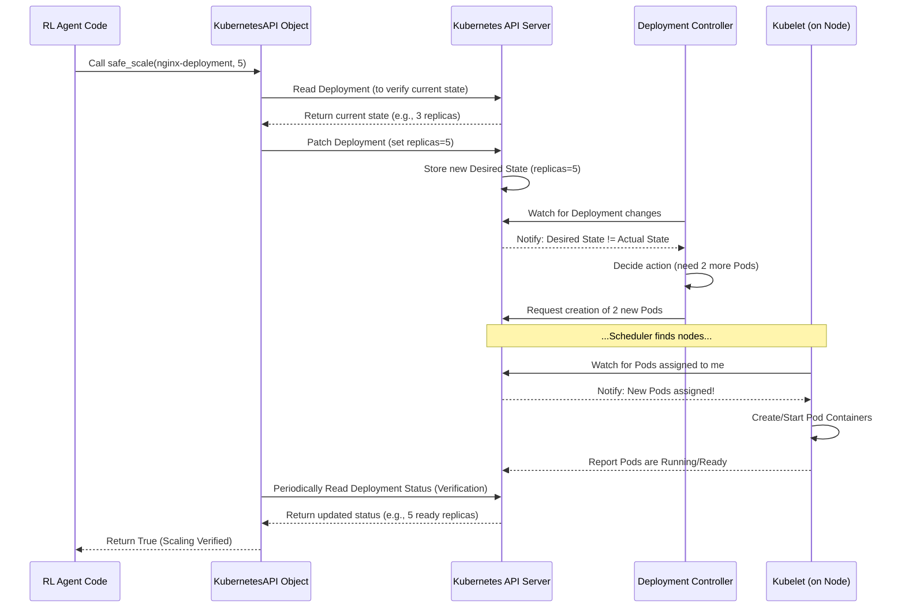

# Chapter 3: Kubernetes Interaction (API)

Welcome back! In [Chapter 1: Kubernetes Configuration](01_kubernetes_configuration_.md), we learned how to describe our desired application environment using YAML blueprints. In [Chapter 2: Observability & Metrics](02_observability___metrics_.md), we explored how to monitor our running application and collect performance data using tools like Prometheus and Grafana.

Now, we have our application running based on our blueprints, and we can see how it's performing thanks to our monitoring tools. But what if we want to *change* something based on those metrics? For example, if our monitoring shows that our Nginx web server is overloaded and responding slowly, we need a way to tell Kubernetes to add more Nginx pods to handle the extra traffic.

This is where **Kubernetes Interaction (API)** comes in. It's the part of our project that acts like a **remote control** for the Kubernetes cluster. It allows our code (specifically, our RL agent) to:

1.  **Fetch real-time information:** Get the latest metrics and cluster status programmatically.
2.  **Execute commands:** Tell Kubernetes to make changes, like scaling a deployment up or down.

Think of it as the technical liaison between our intelligent autoscaling logic (the RL agent) and the actual Kubernetes environment where the application lives.

## The Kubernetes API: Your Cluster's Front Door

Just like many web services and applications provide an API that developers can use to interact with them programmatically (think of APIs for weather data, social media feeds, etc.), Kubernetes also has a powerful **API Server**.

The Kubernetes API Server is the main gateway to your cluster. Every command you run with `kubectl` (like `kubectl apply`, `kubectl get pods`, `kubectl scale`) is actually just talking to the API Server behind the scenes!

Our project needs to do the same things – get information and make changes – but from within Python code. To do this, we use the official **Kubernetes Python client library**. This library provides Python functions that communicate with the Kubernetes API Server, abstracting away the details of making raw HTTP requests.

## The `KubernetesAPI` Class: Our Custom Remote Control

The `microk8s-autoscaling` project encapsulates the interactions with both the Kubernetes API and the Prometheus API (for metrics) within a single Python class: `KubernetesAPI`. You can find this in the file [`agent/kubernetes_api.py`](#).

This class serves as our project's convenient interface for talking to the cluster. Instead of writing complex code every time we need to check the number of pods or request a scale operation, we can just call methods on an instance of this `KubernetesAPI` class.

## Use Case: Scaling the Nginx Deployment

Let's focus on the most critical interaction for autoscaling: changing the number of Nginx pods. We defined our Nginx application using a `Deployment` resource in [Chapter 1: Kubernetes Configuration](01_kubernetes_configuration_.md). Scaling means changing the `replicas` field in that `Deployment`.

In our code, we want to be able to say something like: "Hey Kubernetes, make sure there are 5 copies (replicas) of the Nginx application running!"

The `KubernetesAPI` class provides a method specifically for this: `safe_scale`.

Here's a simplified look at how you might use it (this isn't runnable standalone, but shows the concept):

```python
# Simplified example demonstrating how to use the KubernetesAPI class
# (This snippet is for conceptual understanding, not runnable code)

from agent.kubernetes_api import KubernetesAPI, KubernetesAPIError

# Assume you have a KubernetesAPI instance
k8s_api = KubernetesAPI(max_pods=10) # Initialize the remote control

deployment_name = "nginx-deployment" # Name of the Nginx Deployment (from Chapter 1)
desired_replicas = 5 # The number of pods we want

print(f"Attempting to scale {deployment_name} to {desired_replicas} replicas...")

try:
    # Use the safe_scale method to request the change
    success = k8s_api.safe_scale(deployment_name, desired_replicas)

    if success:
        print(f"Successfully requested scaling to {desired_replicas} replicas.")
        # Note: Success here means the API call was accepted and verified,
        # not necessarily that all pods are instantly ready.

except KubernetesAPIError as e:
    print(f"Error scaling deployment: {e}")
```

**Explanation:**

1.  We create an instance of the `KubernetesAPI` class. The `max_pods` argument sets a maximum limit for scaling, which is good practice.
2.  We define the `deployment_name` (the name of the `Deployment` resource we want to scale) and the `desired_replicas` (the target number of pods).
3.  We call `k8s_api.safe_scale(deployment_name, desired_replicas)`. This is the core action!
4.  The method attempts to tell Kubernetes to update the specified Deployment's `replicas` count.
5.  It returns `True` if the operation was successful and verified within a timeout, or raises a `KubernetesAPIError` if something went wrong (like the deployment not existing or a timeout occurring while waiting for pods).

This `safe_scale` method is the mechanism the RL agent will use to implement its scaling "actions" within the [RL Environment](05_rl_environment_.md).

## Under the Hood: How `safe_scale` Works

So, what does `k8s_api.safe_scale` actually *do*? It's not just one simple step. Here's a simplified sequence of events when you call `safe_scale`:

1.  **Connect:** The `KubernetesAPI` object first needs to establish a connection to the Kubernetes API Server. It tries to do this automatically using credentials available inside a cluster (like in a pod) or falling back to your local Kubernetes configuration file (`~/.kube/config`).
    ```python
    # Simplified connection logic from agent/kubernetes_api.py
    try:
        config.load_incluster_config()  # Try in-cluster config first
    except config.ConfigException:
        config.load_kube_config()  # Fallback to local kubeconfig

    # Initialize API clients
    self.apps_api = client.AppsV1Api(...) # For Deployments
    self.core_api = client.CoreV1Api(...) # For Pods, Nodes
    self.prometheus = PrometheusConnect(...) # For metrics
    ```
    This ensures the class can communicate with the cluster API and Prometheus.

2.  **Check Current State:** Before scaling, it's often useful to know the current number of replicas. The `safe_scale` method might do this implicitly or rely on other parts of the logic, but the `KubernetesAPI` class has a method like `_get_current_replicas` using the Kubernetes client's `AppsV1Api`.
    ```python
    # Simplified check for current replicas
    deployment = self.apps_api.read_namespaced_deployment(deployment_name, self.namespace)
    current_replicas = deployment.spec.replicas or 1
    ```
    This reads the current state of the Deployment from the API Server.

3.  **Validate and Determine Target:** It ensures the `desired_replicas` is within acceptable bounds (e.g., between 1 and `max_pods`).

4.  **Send the Scale Command (Patch):** This is the core interaction step. The client library sends a request to the Kubernetes API Server telling it to update (`patch`) the specified Deployment resource. Specifically, it changes the `spec.replicas` field.
    ```python
    # Simplified scaling action (patching the deployment)
    patch_body = {"spec": {"replicas": desired_replicas}}
    self.apps_api.patch_namespaced_deployment(
        name=deployment_name,
        namespace=self.namespace,
        body=patch_body
    )
    ```
    This simple `patch_namespaced_deployment` call tells the API Server the new desired state.

5.  **Kubernetes Takes Over:** Once the API Server receives the patch, Kubernetes' internal controllers (like the Deployment Controller) notice that the *desired* state (e.g., 5 replicas) is different from the *actual* state (e.g., 3 replicas). Kubernetes then works to make the actual state match the desired state by creating or deleting pods. This takes some time as new pods need to be scheduled, created, and started.

6.  **Verify (Wait for Completion):** The `safe_scale` method doesn't just send the command and finish. It includes a verification step (`_verify_pod_scale`) that waits for the Kubernetes cluster to actually *reach* the desired state (or get close enough) within a certain timeout. This is important for reliability in the RL loop, ensuring an action has taken effect before potentially taking another.
    ```python
    # Simplified verification loop
    # This loop waits for the deployment status to show the desired number of ready replicas
    while time.time() - start_time < timeout:
        deployment = self.apps_api.read_namespaced_deployment(deployment_name, self.namespace)
        ready_replicas = deployment.status.ready_replicas or 0
        # Check if ready_replicas matches desired
        if ready_replicas >= desired_replicas: # Simplified check
             return True # Success!
        time.sleep(5) # Wait a bit before checking again
    # If loop finishes without success, it's a timeout/failure
    ```
    This loop repeatedly checks the status of the deployment using the API until the desired number of replicas are reported as ready or a timeout occurs.

Here's a simplified sequence diagram for the scaling interaction:



This diagram shows how our `KubernetesAPI` object initiates the scaling by talking to the API Server, and then how Kubernetes' internal machinery (Controllers, Scheduler, Kubelet) makes the actual change happen. The `KubernetesAPI` then verifies that the change has taken effect.

## Getting Cluster State (Also Interaction!)

Besides taking action, the `KubernetesAPI` class is also responsible for fetching the state information needed by the RL agent. While [Chapter 2: Observability & Metrics](02_observability___metrics_.md) covered *what* metrics we care about, *how* we get them into our code is part of this interaction layer.

The `KubernetesAPI` class includes methods like `get_cluster_state`, `_get_cpu_usage`, `_get_memory_usage`, `_get_latency`, `_get_pod_count`, and `_get_node_count`.

*   Methods like `_get_pod_count` and `_get_node_count` use the Kubernetes Python client (`CoreV1Api`) to query the Kubernetes API Server directly for information about resources like Pods and Nodes.
    ```python
    # Simplified get pod count
    pods = self.core_api.list_namespaced_pod(self.namespace)
    count = len(pods.items)
    ```
*   Methods like `_get_cpu_usage`, `_get_memory_usage`, and `_get_latency` use the `PrometheusConnect` client (from the `prometheus_api_client` library) to query the Prometheus API. This is how we get the detailed application and resource metrics we discussed in [Chapter 2: Observability & Metrics](02_observability___metrics_.md).
    ```python
    # Simplified Prometheus query
    query = 'sum(rate(container_cpu_usage_seconds_total[1m]))'
    result = self.prometheus.custom_query(query)
    cpu_value = float(result[0]["value"][1]) if result else 0.0
    ```

The `get_cluster_state` method bundles several of these individual metric/state fetches into one convenient call that the RL agent's environment will use.

## Simulation vs. Real Cluster: The Mock API

The `microk8s-autoscaling` project is designed to work with a real MicroK8s cluster *or* in a simulation environment. To achieve this, it uses a **Mock Kubernetes API** (`agent/mock_kubernetes_api.py`) during simulations.

The `MockKubernetesAPI` class provides the *same methods* (`get_cluster_state`, `safe_scale`) as the real `KubernetesAPI` class. However, instead of talking to a real cluster, it uses internal variables and logic to *simulate* the cluster's behavior. When you call `safe_scale` on the mock, it doesn't talk to Kubernetes; it just updates an internal counter for the desired number of pods and simulates the delay and effects of scaling. When you call `get_cluster_state` on the mock, it calculates simulated metrics (like CPU, latency) based on a simulated traffic load and the current simulated number of pods.

This mock implementation is crucial for training the RL agent efficiently without needing a live cluster for every experiment. The agent code interacts with either the real `KubernetesAPI` or the `MockKubernetesAPI` through the same interface, allowing the rest of the agent and environment code to remain largely unchanged between simulation and real-world deployment.

## Summary of Key Interactions

Here's a table summarizing the main ways our code interacts with the cluster via the `KubernetesAPI` class:

| Action             | Purpose                                                          | Method in `KubernetesAPI` | Underlying Communication                     |
| :----------------- | :--------------------------------------------------------------- | :------------------------ | :------------------------------------------- |
| **Get State**      | Fetch current number of pods and nodes.                          | `_get_pod_count`, `_get_node_count` | Kubernetes API Server (CoreV1Api)            |
| **Get Metrics**    | Fetch application/resource metrics (CPU, memory, latency, etc.). | `_get_cpu_usage`, `_get_memory_usage`, `_get_latency`, etc. | Prometheus API Server (via `PrometheusConnect`) |
| **Bundle State**   | Combine various state and metric values into one observation.    | `get_cluster_state`       | Calls other methods internally               |
| **Request Scale**  | Change the desired number of pods for a deployment.            | `_scale_deployment`       | Kubernetes API Server (AppsV1Api - Patch)    |
| **Verify Scale**   | Wait for the cluster to report the desired replicas are ready.   | `_verify_pod_scale`       | Kubernetes API Server (AppsV1Api - Read)     |
| **Safe Scale**     | Combine getting current, validating, requesting, and verifying. | `safe_scale`              | Calls multiple methods internally            |

## Conclusion

In this chapter, you learned that the **Kubernetes API** is the programmatic interface to control and observe your cluster. We saw how the `KubernetesAPI` class in our project uses the Kubernetes Python client and the Prometheus client to act as a bridge, allowing our code to **get cluster state and metrics** and **execute scaling actions** by modifying deployment replicas. You also learned about the `MockKubernetesAPI`, which provides the same interaction interface for simulation purposes.

This interaction layer is fundamental because it's how our RL agent's decisions (which you'll learn about in later chapters) are translated into actual changes in the Kubernetes cluster, and how the agent receives the feedback needed to learn.

With the blueprints defined ([Chapter 1](01_kubernetes_configuration_.md)), the monitoring in place ([Chapter 2](02_observability___metrics_.md)), and the ability to interact with the cluster (this chapter), we have the core technical pieces. The next chapter will look at the scripts that orchestrate bringing all these pieces together.

[Project Orchestration Scripts](04_project_orchestration_scripts_.md)

---

<sub><sup>Generated by [AI Codebase Knowledge Builder](https://github.com/The-Pocket/Tutorial-Codebase-Knowledge).</sup></sub> <sub><sup>**References**: [[1]](https://github.com/rohmatmret/microk8s-autoscaling/blob/ff93765af606c718dc57fc58e4284e10f9ff1560/agent/__init__.py), [[2]](https://github.com/rohmatmret/microk8s-autoscaling/blob/ff93765af606c718dc57fc58e4284e10f9ff1560/agent/kubernetes_api.py), [[3]](https://github.com/rohmatmret/microk8s-autoscaling/blob/ff93765af606c718dc57fc58e4284e10f9ff1560/agent/mock_kubernetes_api.py)</sup></sub>