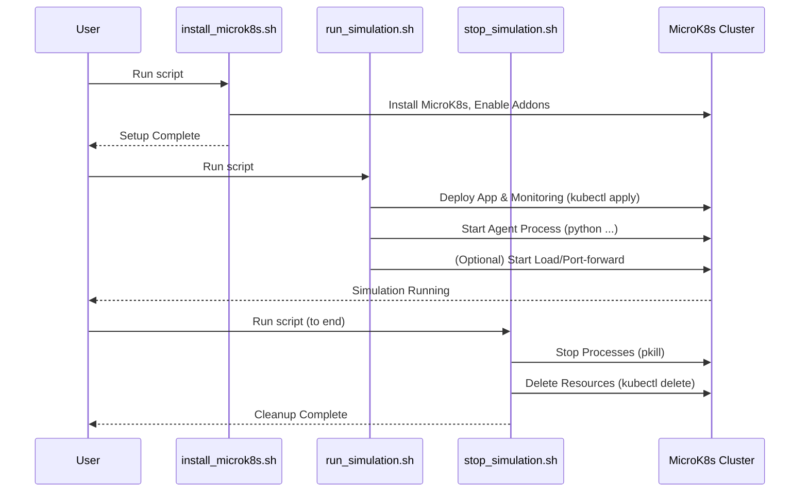

# Chapter 4: Project Orchestration Scripts

Welcome back! In the previous chapters, we laid the groundwork: we learned how to define our applications using [Kubernetes Configuration](01_kubernetes_configuration_.md) files (Chapter 1), how to monitor their performance and collect [Observability & Metrics](02_observability___metrics_.md) (Chapter 2), and how our code can programmatically interact with the cluster via the [Kubernetes Interaction (API)](03_kubernetes_interaction__api__.md) (Chapter 3) to fetch data and make changes like scaling.

Now, imagine putting all of this together to run an actual experiment. You would need to:

1.  Set up a Kubernetes cluster (like MicroK8s).
2.  Configure `kubectl` access.
3.  Install necessary tools (like Python dependencies, possibly k6 for load testing).
4.  Deploy all the Kubernetes resources (your application, monitoring tools, etc.).
5.  Start your application and monitoring.
6.  Run the RL training or simulation process (which involves the agent interacting with the environment, fetching metrics, and scaling).
7.  Generate load to test the autoscaling.
8.  After the experiment, clean up all the deployed resources to free up space.

That's a *lot* of manual steps! Running these commands one by one every time you want to test something would be tedious, slow, and prone to human error. This is where **Project Orchestration Scripts** come in.

Think of these scripts as the **conductor of our project orchestra**. They know the order of operations and execute all the necessary commands automatically, bringing together all the different pieces we've discussed (configuration files, API interactions, agent code) into a cohesive workflow.

These scripts automate the essential steps, from setting up the environment to cleaning up afterward. They are the primary way you will interact with the project to get it up and running for simulations or real-world testing.

## Why Scripts? Automating the Workflow

The main goal of these scripts is to **simplify and automate** the project's lifecycle. Instead of remembering and typing many commands, you can run one script, and it takes care of everything. This makes experiments repeatable and development faster.

The `microk8s-autoscaling` project includes several shell scripts in the `scripts/` directory, each handling a different phase of the workflow:

*   `install_microk8s.sh`: Handles setting up the basic environment, including MicroK8s itself, especially for macOS users using Multipass.
*   `run_simulation.sh`: Deploys the application and monitoring components and starts the RL agent in simulation mode.
*   `training.sh`: A more general script used internally (often by `run_simulation.sh` or `Makefile`) to specifically launch the RL agent's training process with specified parameters.
*   `stop_simulation.sh`: Cleans up running processes and Kubernetes resources.
*   `cleaning.sh`: Provides a more drastic cleanup by resetting MicroK8s.

Let's look at what some of these scripts do.

## Setting Up the Environment: `install_microk8s.sh`

The `install_microk8s.sh` script (specifically tailored for macOS with Multipass in the provided project structure) is responsible for getting your machine ready to run the project.

Its core tasks include:

1.  Ensuring prerequisites like Homebrew (a package manager for macOS) and Multipass (a tool to run virtual machines easily) are installed.
2.  Creating a new virtual machine using Multipass to host MicroK8s.
3.  Installing MicroK8s inside that virtual machine.
4.  Enabling necessary MicroK8s addons (like DNS, storage, metrics-server) that our project needs.
5.  Fetching the Kubernetes configuration (`kubeconfig`) from the VM and merging it with your local `kubeconfig` so your local `kubectl` command can talk to MicroK8s running in the VM.

Here's a simplified look at some key actions within the script:

```bash
# Simplified snippet from scripts/install_microk8s.sh

# Install Multipass
brew install multipass

# Create a VM named microk8s-vm
multipass launch --name microk8s-vm --cpus 2 --mem 4G --disk 40G

# Execute commands inside the VM
multipass exec microk8s-vm -- /bin/bash -c "
    # Install MicroK8s classic channel 1.32
    sudo snap install microk8s --classic --channel=1.32
    # Add user to microk8s group
    sudo usermod -a -G microk8s ubuntu
    # Enable addons
    microk8s enable dns storage metrics-server
"

# Fetch kubeconfig from VM to host
multipass exec microk8s-vm -- /snap/bin/microk8s config > "$TEMP_CONFIG"

# Merge kubeconfig (uses kubectl locally)
KUBECONFIG="$KUBE_CONFIG:$TEMP_CONFIG" kubectl config view --flatten > "$KUBE_CONFIG.new"
```

**Explanation:**

*   The `brew install multipass` command uses Homebrew to install the Multipass tool.
*   `multipass launch` creates and starts the virtual machine with specified resources (CPUs, memory, disk).
*   `multipass exec ...` allows us to run commands *inside* the newly created VM, such as installing MicroK8s using `snap install` and enabling addons like `dns`, `storage`, and `metrics-server`.
*   `microk8s enable metrics-server` is particularly important as the metrics server provides basic CPU/Memory metrics that Kubernetes uses for default Horizontal Pod Autoscaling (HPA), which our RL agent might observe or replace.
*   `multipass exec ... microk8s config` retrieves the necessary connection information from MicroK8s within the VM.
*   The final `kubectl config view --flatten` command combines the VM's kubeconfig with your existing one, making the MicroK8s cluster accessible from your local `kubectl` command and, crucially, from the Python [Kubernetes Interaction (API)](03_kubernetes_interaction__api__.md) client used by the agent.

This script automates the complex process of getting a functional MicroK8s environment running and accessible, which is the necessary foundation before deploying applications or running the agent.

## Running the Simulation: `run_simulation.sh`

The `run_simulation.sh` script is the main entry point for starting a full simulation or experiment run after the environment is set up.

Its key responsibilities include:

1.  Activating the Python virtual environment to ensure all required libraries are available.
2.  Verifying that MicroK8s is running and ready.
3.  Ensuring core MicroK8s addons are enabled.
4.  Enabling and configuring the observability stack (Prometheus and Grafana addons), which involves deploying many Kubernetes resources automatically (referencing [Observability & Metrics](02_observability___metrics_.md)).
5.  Deploying the project's specific application resources defined in the [Kubernetes Configuration](01_kubernetes_configuration_.md) files (Nginx deployment, service, etc.).
6.  Starting the main RL agent Python script in the background.
7.  Optionally starting a load generation process (like a k6 job) and setting up port-forwarding for Grafana access.

Here are simplified snippets showing some of these steps:

```bash
# Simplified snippet from scripts/run_simulation.sh

# Activate Python Venv
source "$VENV_DIR/bin/activate"

# Verify MicroK8s is ready
microk8s status --wait-ready --timeout $TIMEOUT

# Enable observability stack (Prometheus, Grafana, etc.)
# This command deploys many monitoring resources
microk8s enable observability ... --extra-args="..."

# Deploy application Kubernetes resources
kubectl apply -f "config/nginx-config.yaml"
kubectl apply -f "deployments/nginx-deployment.yaml"
# Note: ServiceMonitor is often deployed by observability addon or applied separately
# kubectl apply -f "monitoring/nginx-servicemonitor.yaml"

# Wait for application pods to be ready
kubectl wait --for=condition=ready pod -l app=nginx --timeout=$TIMEOUT

# Start the RL agent script (running in the background '&')
# This script will use the Kubernetes API (Chapter 3) and the RL Environment (Chapter 5)
python "agent/$AGENT.py" --simulate ... &
AGENT_PID=$! # Store the agent's process ID

# Optional: Start Grafana port-forward for easy access
kubectl port-forward -n observability svc/kube-prom-stack-grafana $GRAFANA_PORT:80 &
GRAFANA_PID=$! # Store the port-forward process ID
```

**Explanation:**

*   `source "$VENV_DIR/bin/activate"` ensures that Python commands run within the project's isolated environment with all dependencies installed.
*   `microk8s enable observability` is a convenient MicroK8s command that deploys the entire Prometheus and Grafana stack. The `--extra-args` are used here to configure resource limits, making it fit better on smaller VMs – this shows how scripts can tailor configurations.
*   `kubectl apply -f ...` is used to deploy our specific application resources defined in the YAML files ([Chapter 1](01_kubernetes_configuration_.md)). This creates the Nginx deployment, service, and configuration map.
*   `kubectl wait --for=condition=ready pod -l app=nginx` pauses the script until the Nginx application pods report that they are ready to receive traffic. This is important to ensure the application is running before starting the agent or load test.
*   `python "agent/$AGENT.py" ... &` runs the main Python script for the RL agent. The `&` puts it in the background so the script can continue (e.g., to start port-forwarding). This Python script contains the logic for the [RL Agent](06_rl_agent__dqn_ppo__.md) and interacts with the [RL Environment](05_rl_environment_.md), which in turn uses the [Kubernetes Interaction (API)](03_kubernetes_interaction__api__.md) to observe and act on the cluster.
*   `kubectl port-forward ... &` makes Grafana accessible on your local machine's browser, allowing you to visualize the metrics discussed in [Chapter 2](02_observability___metrics_.md).

This script automates the complex startup sequence, ensuring all components are deployed and running before the core RL agent process begins.

## Running the Agent Training: `training.sh`

The `training.sh` script is a more focused utility, often called by other scripts or `Makefile` targets. Its primary role is to execute the RL agent's main Python script with specific parameters for training.

Here's a simplified view:

```bash
# Simplified snippet from scripts/training.sh

# Activate virtual environment
source "$VENV_DIR/bin/activate"

# Set PYTHONPATH so Python can find project modules
export PYTHONPATH="$PROJECT_ROOT:$PYTHONPATH"

# Run the agent Python script
# Pass mode (simulate/real), timesteps, eval episodes as arguments
python "agent/$AGENT.py" --simulate --timesteps "$TIMESTEPS" --eval-episodes "$EVAL_EPISODES"

# Deactivate virtual environment
deactivate
```

**Explanation:**

*   Similar to `run_simulation.sh`, it activates the virtual environment.
*   `export PYTHONPATH="..."` is crucial for Python to correctly import modules from the project directories (like `agent`, `simulation`, etc.).
*   `python "agent/$AGENT.py" ...` is the command that actually launches the RL training process. The arguments passed (`--simulate`, `--timesteps`, etc.) configure the agent's behavior and training duration. This command runs the core logic that utilizes the [RL Environment](05_rl_environment_.md), which in turn uses the [Kubernetes Interaction (API)](03_kubernetes_interaction__api__.md) and relies on the observability setup ([Observability & Metrics](02_observability___metrics_.md)) interacting with the deployed [Kubernetes Configuration](01_kubernetes_configuration_.md).

While `run_simulation.sh` sets up the *entire scenario*, `training.sh` focuses specifically on getting the *agent training process* running correctly within that scenario.

## Cleaning Up: `stop_simulation.sh`

After an experiment or simulation, it's important to clean up the resources to avoid consuming unnecessary CPU, memory, and disk space. The `stop_simulation.sh` script handles this.

Its tasks include:

1.  Stopping any background processes started by the simulation script (like the agent or port-forwarding).
2.  Deleting the Kubernetes resources that were deployed (application deployments, services, configmaps, etc.).
3.  Attempting more forceful cleanup for resources that might get stuck.

Here's a simplified look:

```bash
# Simplified snippet from scripts/stop_simulation.sh

echo "🛑 Stopping simulation processes..."
# Kill processes by name
pkill -f dqn.py || true # Kill the DQN agent script
pkill -f ppo.py || true # Kill the PPO agent script
pkill -f k6 || true     # Kill any k6 load test processes
pkill -f "port-forward" || true # Kill kubectl port-forward processes

echo "🧹 Cleaning Kubernetes resources..."
# Delete resources using kubectl
# Deleting 'all' types often covers deployments, services, etc.
kubectl delete --all all --all-namespaces --force --grace-period=0 2>/dev/null
kubectl delete --all configmaps --all-namespaces --force --grace-period=0 2>/dev/null
kubectl delete --all ingress --all-namespaces --force --grace-period=0 2>/dev/null

# Additional forceful cleanup steps if needed
# ... (commands to remove finalizers or restart components)
```

**Explanation:**

*   `pkill -f ...` is a command to find processes whose command line matches a pattern (like `dqn.py`) and send them a termination signal. `|| true` prevents the script from stopping if a process isn't found.
*   `kubectl delete --all ...` tells Kubernetes to remove all resources of a specific type (like `all`, `configmaps`, `ingress`) across all namespaces. The `--force --grace-period=0` is a more aggressive way to delete resources that might be stuck in a terminating state.
*   Additional commands are included to handle specific cleanup issues that can sometimes occur with Kubernetes resources or addons.

Running this script ensures that the resources deployed for the simulation are removed, leaving the cluster in a cleaner state for future use or other tasks.

## The Orchestration Flow

Putting it all together, here's how these scripts orchestrate the overall workflow:

1.  **Initial Setup:** You run `install_microk8s.sh` once to prepare your environment and MicroK8s cluster.
2.  **Run Experiment:** You run `run_simulation.sh` (or use a `Makefile` target that calls it) to:
    *   Ensure MicroK8s and core addons are ready.
    *   Deploy the monitoring stack (Prometheus, Grafana) and your application (Nginx, exporter) using `kubectl apply` based on the [Kubernetes Configuration](01_kubernetes_configuration_.md).
    *   Start the RL agent process by calling the relevant Python script (e.g., `agent/dqn.py` or `agent/ppo.py`), setting up its environment (`training.sh` logic). This agent will interact with Kubernetes via the [Kubernetes Interaction (API)](03_kubernetes_interaction__api__.md) and use metrics from the [Observability & Metrics](02_observability___metrics_.md) setup as input for its decisions within the [RL Environment](05_rl_environment_.md).
    *   (Optional) Start related tools like k6 for load generation and Grafana port-forwarding.
3.  **Monitor and Observe:** While the simulation runs, you can (if enabled) access Grafana to see the metrics ([Observability & Metrics](02_observability___metrics_.md)) and see how the agent's actions affect the system.
4.  **Cleanup:** When the experiment is finished or you want to stop, you run `stop_simulation.sh` to terminate processes and delete Kubernetes resources.

Here's a simplified sequence of the main user interactions via scripts:



This diagram shows how the scripts abstract away the underlying complexity, allowing the user to manage the entire project lifecycle with just a few commands.

## Summary of Orchestration Scripts

| Script Name          | Purpose                                                                 | Key Actions                                                              |
| :------------------- | :---------------------------------------------------------------------- | :----------------------------------------------------------------------- |
| `install_microk8s.sh`| Prepare the local/VM environment and install/configure MicroK8s.        | Install Multipass/Homebrew, Create/Start VM, Install MicroK8s, Enable addons, Configure kubeconfig. |
| `run_simulation.sh`  | Deploy project components, start the RL agent, and initiate the simulation/experiment. | Activate Venv, Verify MicroK8s, Enable observability, Deploy app (kubectl apply), Start agent script, (Optional) Start load/port-forward. |
| `training.sh`        | Execute the core RL agent training script with specific parameters.       | Activate Venv, Set PYTHONPATH, Run `agent/dqn.py` or `agent/ppo.py` with arguments. |
| `stop_simulation.sh` | Terminate running processes and remove deployed Kubernetes resources.     | Kill agent/loadtest/port-forward processes, Delete K8s resources (kubectl delete). |
| `cleaning.sh`        | Perform a more aggressive MicroK8s reset.                               | Run `microk8s reset --destroy-storage`.                                  |

These scripts are your primary interface for working with the `microk8s-autoscaling` project. They streamline the setup, execution, and cleanup, allowing you to focus on the experiments themselves rather than the operational details.

## Conclusion

In this chapter, you learned that the **Project Orchestration Scripts** in the `scripts/` directory are crucial for automating the complex workflow of setting up the environment, deploying Kubernetes resources, running the RL agent, and cleaning up. Scripts like `install_microk8s.sh`, `run_simulation.sh`, `training.sh`, and `stop_simulation.sh` act as the conductor, bringing together the concepts from the previous chapters ([Kubernetes Configuration](01_kubernetes_configuration_.md), [Observability & Metrics](02_observability___metrics_.md), [Kubernetes Interaction (API)](03_kubernetes_interaction__api__.md)) into a single, manageable process.

Understanding these scripts helps you run the project efficiently. Now that we know how to automate the setup and execution, we can dive into the heart of the project: the environment where the RL agent learns.

In the next chapter, we will explore the **[RL Environment](05_rl_environment_.md)**, which provides the simulation or real-world interaction context for the agent, feeding it observations (including the metrics we discussed) and processing its actions (like scaling).

[RL Environment](05_rl_environment_.md)

---

<sub><sup>Generated by [AI Codebase Knowledge Builder](https://github.com/The-Pocket/Tutorial-Codebase-Knowledge).</sup></sub> <sub><sup>**References**: [[1]](https://github.com/rohmatmret/microk8s-autoscaling/blob/ff93765af606c718dc57fc58e4284e10f9ff1560/README.md), [[2]](https://github.com/rohmatmret/microk8s-autoscaling/blob/ff93765af606c718dc57fc58e4284e10f9ff1560/scripts/cleaning.sh), [[3]](https://github.com/rohmatmret/microk8s-autoscaling/blob/ff93765af606c718dc57fc58e4284e10f9ff1560/scripts/install_microk8s.sh), [[4]](https://github.com/rohmatmret/microk8s-autoscaling/blob/ff93765af606c718dc57fc58e4284e10f9ff1560/scripts/run_simulation.sh), [[5]](https://github.com/rohmatmret/microk8s-autoscaling/blob/ff93765af606c718dc57fc58e4284e10f9ff1560/scripts/stop_simulation.sh), [[6]](https://github.com/rohmatmret/microk8s-autoscaling/blob/ff93765af606c718dc57fc58e4284e10f9ff1560/scripts/training.sh)</sup></sub>