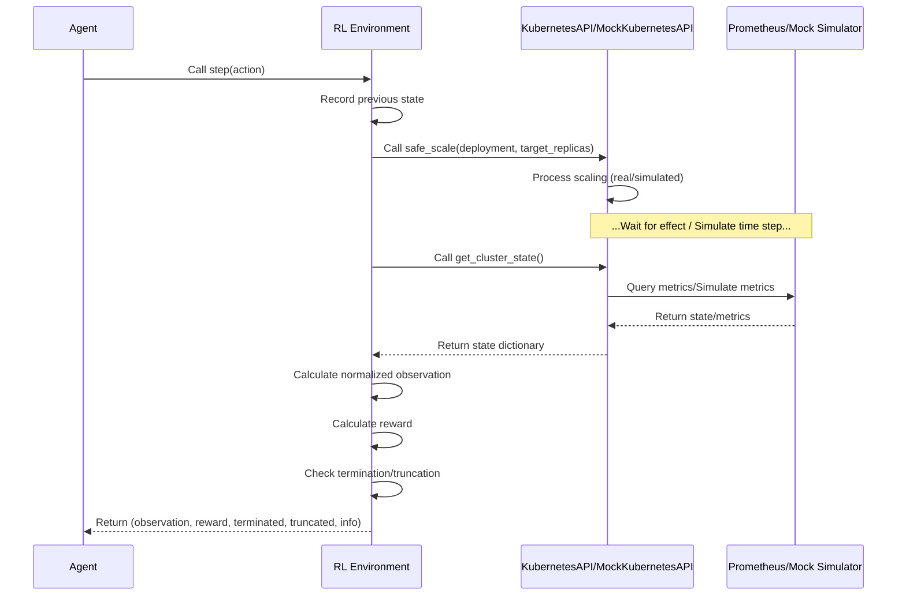

# Chapter 5: RL Environment

Welcome back! In the previous chapters, we covered the essential building blocks: we learned about [Kubernetes Configuration](01_kubernetes_configuration_.md) as the blueprints for our system, how to get visibility into performance using [Observability & Metrics](02_observability___metrics_.md), how our code can use the [Kubernetes Interaction (API)](03_kubernetes_interaction___api__.md) as a remote control, and how [Project Orchestration Scripts](04_project_orchestration_scripts_.md) automate the setup and cleanup.

Now, we arrive at a crucial piece: the **RL Environment**.

Imagine you are teaching a dog a new trick. You show it what you want, it tries something, and you give it a treat if it does well or nothing (or a gentle "no") if it doesn't. The dog is the "agent" learning the trick. The world around the dog, including you giving feedback, is the "environment".

In **Reinforcement Learning (RL)**, we train an "agent" (our intelligent autoscaler) to make decisions by having it interact with an "environment". The environment is the "world" the agent lives in. It provides the agent with **observations** about the current state of the world, allows the agent to take **actions**, and gives the agent a **reward** (a score) based on how good or bad the result of the action was.

For our `microk8s-autoscaling` project, the **RL Environment represents the Kubernetes cluster and the application running on it**. It's the bridge between the abstract logic of the RL agent and the concrete reality (or simulation) of the application's performance and the cluster's state.

Its main job is to:

1.  Present the agent with the current **state** of the system (like CPU usage, latency, number of pods). This is the agent's "eyes".
2.  Accept an **action** from the agent (like "scale up" or "scale down"). This is how the agent tries to interact with the world.
3.  Execute that action in the cluster (or simulation).
4.  Wait for the system to react and potentially stabilize.
5.  Collect the **new state** after the action has taken effect.
6.  Calculate a **reward** based on the transition from the old state to the new state and the action taken. This tells the agent if it's doing a good job.

This cycle of (Observe -> Act -> Get Reward & New Observe) is how the agent learns.

## The Core Idea: The Standard RL Loop

Most RL training frameworks follow a standard loop of interaction between the agent and the environment. It looks something like this:

1.  The environment starts in an initial state (`env.reset()`).
2.  The agent receives the initial observation from the environment.
3.  Loop for many steps (or until the episode ends):
    a.  The agent uses its current knowledge (its learned "policy") to choose an **action** based on the current observation.
    b.  The agent sends the chosen action to the environment (`env.step(action)`).
    c.  The environment executes the action, updates its internal state, and calculates the **reward**, the next **observation**, and whether the episode is **done**.
    d.  The environment sends the reward, the next observation, and the 'done' status back to the agent.
    e.  The agent uses this feedback (the old observation, the action, the reward, the new observation, done) to update its knowledge and improve its policy.
    f.  The agent sets the new observation as its current observation.
    g.  If the episode is done, reset the environment and start a new episode.

Our `MicroK8sEnv` class is designed to fit this standard loop, making it compatible with popular RL libraries like Stable Baselines3.

## What Defines the Environment? State, Action, Reward

An RL environment is formally defined by three key components:

1.  **Observation Space (State Space):** What information the agent receives. For our autoscaling agent, this includes metrics about application performance and cluster resources.
2.  **Action Space:** The set of possible actions the agent can take. Our agent needs to be able to tell the system to change the number of pods.
3.  **Reward Function:** The rule that determines the reward signal the agent receives after each action. This function encodes the goal we want the agent to achieve (e.g., maintain low latency while minimizing costs).

Let's look at how these are defined in our environment classes (`agent/environment.py` and `agent/environment_simulated.py`).

### Observation Space: What the Agent Sees

The agent needs to see the state of the system to make informed scaling decisions. Based on our discussion of [Observability & Metrics](02_observability___metrics_.md), useful information includes resource utilization, performance indicators, and potentially the current number of pods.

In the provided code, the environment defines its observation space using `gymnasium.spaces.Box` (or `gym.spaces.Box` in older versions). This indicates the observation is a multi-dimensional box (like a list or array) of numerical values, each within a certain range.

Here's a look at the observation space definition (simplified from `agent/environment_simulated.py`, as it's more detailed than the real-cluster one):

```python
# Simplified snippet from agent/environment_simulated.py
from gymnasium import spaces
import numpy as np

class MicroK8sEnvSimulated(gym.Env):
    def __init__(self, ...):
        # ... other initialization ...

        # Observation space: [cpu, memory, latency, swap, nodes, load_mean, load_gradient]
        self.observation_space = spaces.Box(
            low=np.array([0.0, 0.0, 0.0, 0.0, 0.0, 0.0, -1.0]),
            high=np.array([1.0, 1.0, 1.0, 1.0, 1.0, 1.0, 1.0]),
            dtype=np.float64
        )
        # ... rest of init ...
```

**Explanation:**

*   `spaces.Box(...)` defines a box-shaped space.
*   `low=np.array([...])` and `high=np.array([...])` define the minimum and maximum possible values for each element in the observation array. Normalizing values (like percentages or ratios) to be between 0.0 and 1.0 is common practice in RL.
*   `dtype=np.float64` specifies that the values are floating-point numbers.

The specific order of metrics in the array (`[cpu, memory, latency, swap, nodes, load_mean, load_gradient]`) is fixed. The agent will receive an array like `[0.45, 0.30, 0.15, 0.01, 1.0, 0.55, 0.02]`, representing, for example, 45% CPU, 30% memory, 150ms latency, etc. The agent learns to interpret these numbers to understand the system state.

### Action Space: What the Agent Can Do

Our autoscaling agent needs to control the number of pods. The simplest actions are:

*   Increase the number of pods (scale up).
*   Decrease the number of pods (scale down).
*   Keep the number of pods the same (no operation, or "no-op").

This is a discrete set of actions (there are only 3 choices). The environment defines this using `gymnasium.spaces.Discrete`.

Here's the action space definition:

```python
# Simplified snippet from agent/environment.py and agent/environment_simulated.py
from gymnasium import spaces

class MicroK8sEnv(gym.Env): # Or MicroK8sEnvSimulated
    def __init__(self, ...):
        # ... other initialization ...

        # Action: [scale up, scale down, no-op] (Order matters for indexing)
        # Let's assume 0: no-op, 1: scale-up, 2: scale-down as per the step logic below
        self.action_space = spaces.Discrete(3)

        # ... rest of init ...
```

**Explanation:**

*   `spaces.Discrete(3)` defines a space representing a fixed number of distinct items. In this case, 3 actions, which will be represented by integers 0, 1, and 2.
*   The comment indicates which integer corresponds to which action. It's important that the agent and environment agree on this mapping! The `step` method uses this mapping.

When the agent chooses action `1`, it means "scale up". When it chooses action `2`, it means "scale down". When it chooses `0`, it means "do nothing".

### Reward Function: How the Agent Gets Feedback

The reward function is perhaps the most critical part of the environment design. It tells the agent *what success looks like*. A well-designed reward function encourages the agent to achieve the desired goals (e.g., good performance, low cost) and penalizes undesirable outcomes (e.g., high latency, excessive resource use).

The reward is calculated in the `_calculate_reward` method within the environment class. The goal is to balance conflicting objectives:

*   **Good Performance:** Low latency, sufficient CPU/Memory utilization (not overloaded).
*   **Low Cost:** Using minimal pods/resources.

This is a trade-off: more pods usually means better performance (up to a point) but costs more. The reward function needs to reflect this balance.

Here's a look at the structure of the reward function (simplified and conceptualized from `agent/environment_simulated.py`):

```python
# Simplified Conceptualization of _calculate_reward logic
class MicroK8sEnvSimulated(gym.Env):
    def _calculate_reward(self, state: Dict, action: int, success: bool) -> float:
        # Get current state metrics (CPU, Memory, Latency, Pods, etc.)
        cpu = state["cpu"]
        memory = state["memory"]
        latency = state["latency"]
        pods = state["pods"]
        # ... get other state info like load gradient ...

        reward = 0.0 # Start with a base reward

        # Add/Subtract based on performance metrics
        if latency < LOW_LATENCY_THRESHOLD:
            reward += POSITIVE_REWARD
        elif latency > HIGH_LATENCY_THRESHOLD:
            reward -= NEGATIVE_PENALTY

        if cpu > HIGH_CPU_THRESHOLD:
            reward -= NEGATIVE_PENALTY
        # ... similar checks for memory, swap ...

        # Add/Subtract based on resource cost (pod count)
        reward -= POD_COST_FACTOR * pods # Penalize having too many pods

        # Add/Subtract based on action effectiveness and response to load
        # Did scaling up help reduce high utilization?
        # Did scaling down happen when resources were low and load was decreasing?
        # ... logic based on action and load gradient ...

        # Penalty for scaling actions themselves (small cost for scaling)
        if action != 0: # If action is scale up or scale down
             reward -= SCALING_ACTION_PENALTY

        # Clamp reward to a reasonable range
        final_reward = np.clip(reward, MIN_REWARD, MAX_REWARD)

        return float(final_reward)
```

**Explanation:**

*   The function takes the *new* state, the *action* taken, and potentially the *previous state* (implicitly, by comparing values from the `state` dictionary which represents the state *after* the action and delay) as input.
*   It assigns positive rewards for desired conditions (like low latency, moderate resource usage) and negative rewards (penalties) for undesirable conditions (high latency, high resource usage, excessive pods).
*   There's often a small penalty for taking any scaling action (`action != 0`) to discourage unnecessary scaling back and forth (thrashing).
*   The specific weights and thresholds (like `LOW_LATENCY_THRESHOLD`, `POD_COST_FACTOR`) are hyper-parameters that need careful tuning to guide the agent towards the desired behavior. The simulated environment code shows various complex reward calculations trying to balance these factors.

This reward signal is the primary way the environment communicates to the agent whether its decisions are leading to good or bad outcomes. The agent's goal during training is to learn a policy that maximizes the total cumulative reward over time.

## Simulation vs. Real Cluster Environments

The project provides two main environment implementations:

1.  **`MicroK8sEnvSimulated`** (`agent/environment_simulated.py`): This environment uses the `MockKubernetesAPI` ([Kubernetes Interaction (API)](03_kubernetes_interaction___api__.md)) and a `TrafficSimulator` ([Load Simulation](07_load_simulation_.md)) to completely simulate the behavior of a MicroK8s cluster under varying load. This is **ideal for training** because simulations are fast, cheap (no real cluster needed), and repeatable. You can run many training episodes quickly. The `run_simulation.sh` script primarily uses this environment.
2.  **`MicroK8sEnv`** (`agent/environment.py`): This environment talks directly to a *real* MicroK8s cluster using the actual `KubernetesAPI` ([Kubernetes Interaction (API)](03_kubernetes_interaction___api__.md)). It queries real Prometheus metrics ([Observability & Metrics](02_observability___metrics_.md)) and executes real scaling commands. This is used for **evaluating** the trained agent's performance in a realistic setting or potentially for training directly on a live (non-production!) cluster, though the latter is much slower and more expensive.

Both environments implement the same standard `gymnasium.Env` interface (`reset()`, `step()`, `observation_space`, `action_space`), meaning the same agent code can interact with either a simulation or the real cluster. This is a powerful design pattern!

## Inside the `step` Method: The Environment's Logic

The heart of the environment is the `step(action)` method. This is where the environment processes the agent's chosen action and determines the next state and reward.

Here's a simplified sequence of what happens inside `step` (referencing logic from `agent/environment_simulated.py`):

1.  **Record Old State:** Store the current state *before* the action is applied (important for reward calculation).
2.  **Apply Action:** Translate the discrete action integer (0, 1, or 2) into a desired number of replicas. Call the `safe_scale` method on the internal API object (`self.api`). If using `MicroK8sEnvSimulated`, this calls `MockKubernetesAPI.safe_scale`. If using `MicroK8sEnv`, this calls `KubernetesAPI.safe_scale` which interacts with the real cluster. Link back to [Kubernetes Interaction (API)](03_kubernetes_interaction___api__.md).
    ```python
    # Simplified from environment.py / environment_simulated.py
    # current_replicas = self.api._get_current_replicas(...) # Get actual pod count
    current_replicas = self.api.get_current_pod_count() # Or mock equivalent

    if action == 0: # No-op
        target_replicas = current_replicas
    elif action == 1: # Scale Up
        target_replicas = min(current_replicas + 1, self.api.max_pods)
    else: # action == 2, Scale Down
        target_replicas = max(current_replicas - 1, 1)

    # Request the scaling operation (real or mock)
    self.api.safe_scale(self.deployment_name, target_replicas)
    ```
3.  **Wait/Simulate Delay:** Real Kubernetes scaling takes time. The environment needs to account for this. In `MicroK8sEnv`, this involves `time.sleep(self.scaling_delay)`. In `MicroK8sEnvSimulated`, the `MockKubernetesAPI` internally simulates this delay and gradual change in active pods.
    ```python
    # In MicroK8sEnv (real cluster)
    time.sleep(self.scaling_delay)

    # In MicroK8sEnvSimulated (mock API handles internal simulation step)
    # self.api.get_cluster_state() call below implicitly steps the simulation
    ```
4.  **Observe New State:** After the delay, get the *new* state of the system. Call a method like `_get_normalized_state()` or `_observe()` which in turn calls `self.api.get_cluster_state()`. This fetches metrics (from Prometheus or the mock simulator) and cluster status (from K8s API or mock). Link back to [Observability & Metrics](02_observability___metrics_.md) and [Kubernetes Interaction (API)](03_kubernetes_interaction___api__.md).
    ```python
    # In both environments, call internal method to get state via API
    new_state = self._get_normalized_state() # or self._observe()
    ```
5.  **Calculate Reward:** Call `_calculate_reward()` comparing the old state (if needed) and the new state, and considering the action.
    ```python
    reward = self._calculate_reward(old_state, new_state, action)
    ```
6.  **Check Termination:** Determine if the episode should end (e.g., if a critical error state is reached, like persistent high latency or resource exhaustion).
    ```python
    terminated = self._is_done() # Example: check if latency is too high
    truncated = self.current_step >= self.max_steps # Simulation specific: check if max steps reached
    ```
7.  **Return Values:** Return the new observation, the calculated reward, and the termination/truncation flags. An optional `info` dictionary is also returned, often containing extra metrics for logging/debugging (linking to [Observability & Metrics](02_observability___metrics_.md) and its logging mechanism).
    ```python
    return new_state, reward, terminated, truncated, info
    ```

Here's a simplified sequence diagram showing the interaction during one `step`:



This diagram illustrates the flow of information and control during a single interaction cycle, which is repeated thousands or millions of times during training.

## Summary of RL Environment Components

| Component             | Role                                                                | Where Defined/Used                                      | Links to Concepts                                       |
| :-------------------- | :------------------------------------------------------------------ | :------------------------------------------------------ | :------------------------------------------------------ |
| **Environment Class** | Implements the standard RL environment interface (`reset`, `step`). | `MicroK8sEnv`, `MicroK8sEnvSimulated` classes in `agent/` | -                                                       |
| **Observation Space** | Defines the format and range of data the agent receives.            | `observation_space = spaces.Box(...)` in `__init__`   | [Observability & Metrics](02_observability___metrics_.md) |
| **Action Space**      | Defines the set of actions the agent can take.                      | `action_space = spaces.Discrete(...)` in `__init__`     | [Kubernetes Interaction (API)](03_kubernetes_interaction___api__.md) |
| **Reward Function**   | Calculates the numerical feedback (score) for the agent.          | `_calculate_reward` method                            | - (Defines the problem's objective)                     |
| **Internal API**      | Interface to get state/metrics and apply actions.                   | `self.k8s = KubernetesAPI(...)` or `self.api = MockKubernetesAPI(...)` | [Kubernetes Interaction (API)](03_kubernetes_interaction___api__.md), [Observability & Metrics](02_observability___metrics_.md) |
| **Simulation Logic**  | (In simulated env only) Mimics cluster behavior and traffic.        | `MockKubernetesAPI`, `TrafficSimulator`                 | [Load Simulation](07_load_simulation_.md)               |

The RL Environment is the crucial abstraction that allows us to train and evaluate our autoscaling agent. It provides the concrete interface for the agent to learn how its actions affect the system's state and receive feedback on its performance.

## Conclusion

In this chapter, you learned that the **RL Environment** is the "world" where the RL agent learns. It defines the rules of interaction, providing the agent with **observations** (system state and metrics), accepting **actions** (scaling commands), and giving **rewards** based on the outcome. We saw how the environment fits the standard `gymnasium` interface and how it's implemented in our project using classes like `MicroK8sEnv` and `MicroK8sEnvSimulated`, which rely on the concepts of [Observability & Metrics](02_observability___metrics_.md) and [Kubernetes Interaction (API)](03_kubernetes_interaction___api__.md). The simulation environment also incorporates a [Load Simulation](07_load_simulation_.md) to create dynamic scenarios for training.

With the environment defined, we now have a clear picture of the agent's world and how it interacts. The next logical step is to understand the **RL Agent** itself – the component that observes this world, makes decisions, and learns from the rewards it receives.

In the next chapter, we will dive into the **[RL Agent (DQN/PPO)](06_rl_agent__dqn_ppo__.md)** and explore how it uses algorithms like Deep Q-Networks or Proximal Policy Optimization to learn an effective autoscaling policy.

[RL Agent (DQN/PPO)](06_rl_agent__dqn_ppo__.md)

---

<sub><sup>Generated by [AI Codebase Knowledge Builder](https://github.com/The-Pocket/Tutorial-Codebase-Knowledge).</sup></sub> <sub><sup>**References**: [[1]](https://github.com/rohmatmret/microk8s-autoscaling/blob/ff93765af606c718dc57fc58e4284e10f9ff1560/agent/__init__.py), [[2]](https://github.com/rohmatmret/microk8s-autoscaling/blob/ff93765af606c718dc57fc58e4284e10f9ff1560/agent/environment.py), [[3]](https://github.com/rohmatmret/microk8s-autoscaling/blob/ff93765af606c718dc57fc58e4284e10f9ff1560/agent/environment_simulated.py), [[4]](https://github.com/rohmatmret/microk8s-autoscaling/blob/ff93765af606c718dc57fc58e4284e10f9ff1560/agent/mock_kubernetes_api.py)</sup></sub>