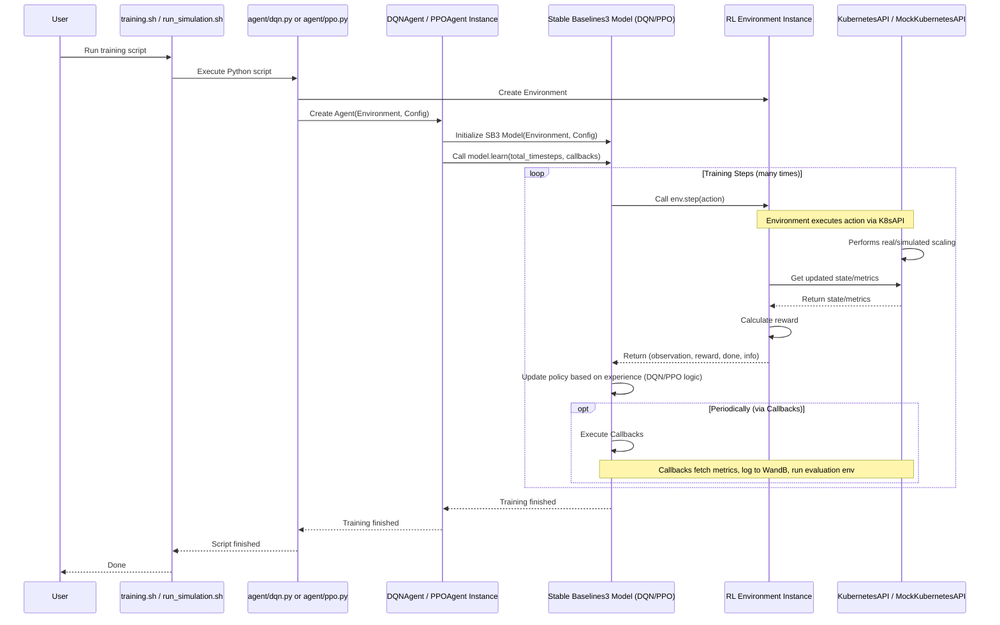

# Chapter 6: RL Agent (DQN/PPO)

Welcome back! In the previous chapter, [RL Environment](05_rl_environment_.md), we built the "world" where our intelligent autoscaler lives and learns. We defined what information the agent sees (the observation space – cluster metrics), what actions it can take (scale up, scale down, no-op), and how it gets feedback (the reward function – balancing performance and cost).

Now, it's time to introduce the star of the show: the **RL Agent**.

Think of the RL Agent as the **brain** of our autoscaling system. Its job is to look at the current state of the Kubernetes cluster (provided as an observation by the [RL Environment](05_rl_environment_.md)), think about what to do (decide on an action), try it out, and then learn from the result (the reward) whether that action was good or bad for the overall goal (maximizing long-term reward).

The core problem the agent solves is: **Given the current application performance (latency, CPU) and resource usage (pods), what is the best scaling action (up, down, or no-op) to take right now to ensure good performance without wasting resources in the future?**

This is a perfect problem for Reinforcement Learning because the agent needs to learn by *trying* actions in the environment and observing the consequences over time, rather than being explicitly told the "correct" action for every possible situation.

## The Goal: Learn a Good Policy

The ultimate goal of training an RL agent is for it to learn a **policy**. The policy is essentially the agent's strategy – a rule or function that maps observations (what the agent sees) to actions (what the agent should do).

*   During **training**, the agent explores different actions, receives rewards, and adjusts its internal workings to improve its policy. It's like practicing the trick over and over, getting better at predicting which moves earn a treat.
*   Once **trained**, the agent uses its learned policy to make decisions. Given a new observation, it uses the policy to select the action it predicts will lead to the best long-term outcome based on its training experience.

## How RL Agents Learn: Trial, Error, and Reward

The basic learning loop for an RL agent interacting with its environment is:

1.  **Observe:** The agent receives the current state (observation) from the [RL Environment](05_rl_environment_.md).
2.  **Decide:** Based on its current policy (and sometimes random exploration during training), the agent chooses an action.
3.  **Act:** The agent sends the chosen action back to the [RL Environment](05_rl_environment_.md).
4.  **Receive Feedback:** The environment executes the action (e.g., scales the deployment via the [Kubernetes Interaction (API)](03_kubernetes_interaction__api__.md)), potentially simulates some time passing, updates its state, and calculates a **reward** based on how good the new state is and the action taken.
5.  **Learn:** The agent receives the new observation and the reward from the environment. It uses this experience (the previous observation, the action taken, the received reward, and the new observation) to update its internal policy or value functions, aiming to choose actions that lead to higher future rewards.
6.  **Repeat:** The cycle continues for many steps or episodes.

Over time, by trying actions and learning from the rewards, the agent's policy becomes better at selecting actions that maximize the cumulative reward, thereby achieving the desired objective (efficient and performant autoscaling).

## Meet DQN and PPO: Two Learning Strategies

Our project uses two popular Reinforcement Learning algorithms: **DQN (Deep Q-Networks)** and **PPO (Proximal Policy Optimization)**. Both are methods the agent uses to learn its policy, and both use neural networks (hence "Deep") to handle complex observations.

They differ in *how* they learn the policy:

### DQN (Deep Q-Networks)

*   **Idea:** DQN learns the **value** of taking a specific action in a specific state. It tries to answer the question: "If I am in *this* state and take *this* action, what is the total future reward I can expect?" This expected future reward is called the "Q-value".
*   **How it works (Simply):** DQN uses a neural network to estimate these Q-values for all possible actions in a given state. The agent then typically chooses the action with the highest estimated Q-value (though sometimes it chooses randomly to explore). It learns by comparing its predicted Q-values to the actual rewards it receives and adjusting the network.
*   **Good for:** Environments with discrete actions (like our "scale up", "scale down", "no-op").

### PPO (Proximal Policy Optimization)

*   **Idea:** PPO learns the **policy** directly. It tries to learn the probability of taking each action in a given state.
*   **How it works (Simply):** PPO uses a neural network (or sometimes two) to output the probabilities for each action. It updates the policy in a way that encourages actions that lead to higher rewards, but crucially, it does so in small, controlled steps ("Proximal") to avoid messing up the learning too much with large updates. It also often estimates the "advantage" of an action – how much better it is than the average expected value of being in that state.
*   **Good for:** Both discrete and continuous action spaces. Often considered more stable and easier to tune than some other policy-learning algorithms.

In our project, you can choose to train either a DQN agent (`agent/dqn.py`) or a PPO agent (`agent/ppo.py`). Both interact with the same [RL Environment](05_rl_environment_.md) and aim to solve the same autoscaling problem.

## The Agent in Our Project: `DQNAgent` and `PPOAgent`

The files `agent/dqn.py` and `agent/ppo.py` contain the Python code for our DQN and PPO agents, respectively. These classes (`DQNAgent` and `PPOAgent`) act as wrappers around powerful, well-tested implementations provided by the **Stable Baselines3** library, which is a popular tool for developing and comparing RL algorithms.

Using Stable Baselines3 means we don't have to write the complex neural network and learning logic from scratch. We just need to:

1.  Define our [RL Environment](05_rl_environment_.md) according to a standard interface (which we did in Chapter 5).
2.  Create an instance of the Stable Baselines3 agent (like `DQN` or `PPO`), telling it which environment to use and what algorithm-specific parameters to apply (learning rate, network structure, etc.).
3.  Call the agent's `learn()` method to start the training process.
4.  Call the agent's `predict()` method to get actions from a trained agent.

Let's look at the basic structure, focusing on how the agent connects to the environment and starts learning.

### Initializing the Agent

When you create an instance of `DQNAgent` or `PPOAgent`, you pass it the environment object (`MicroK8sEnv` or `MicroK8sEnvSimulated`) it will interact with.

Here's a simplified example from `agent/dqn.py` (the PPO setup is similar):

```python
# Simplified snippet from agent/dqn.py main() function

# Create the environment (either simulated or real)
if args.simulate:
    env = MicroK8sEnvSimulated()
else:
    env = MicroK8sEnv()

# Initialize agent, passing the environment and config
agent = DQNAgent(
    env=env, # Pass the environment object
    environment=env, # Also passing the environment reference
    is_simulated=args.simulate,
    learning_rate=args.learning_rate,
    batch_size=args.batch_size
)

# The DQNAgent's __init__ method then initializes the Stable Baselines3 model:
# self.model = DQN(policy=MlpPolicy, env=self.env, ...)
```

**Explanation:**

*   We first create an instance of the appropriate environment class ([RL Environment](05_rl_environment_.md)).
*   We then create an instance of `DQNAgent`, passing this environment object (`env`).
*   Inside the `DQNAgent`'s `__init__`, it creates a Stable Baselines3 `DQN` model, linking it to the provided environment. This is where the core learning logic from Stable Baselines3 is set up to use our specific environment's observation space, action space, and step function.

### Training the Agent (`.learn()`)

Once initialized, you call the `train()` method of our agent wrapper class, which in turn calls the `learn()` method of the underlying Stable Baselines3 model. This starts the main RL training loop.

Here's a simplified view from the `DQNAgent.train()` method:

```python
# Simplified snippet from agent/dqn.py DQNAgent.train()

# Set up callbacks for logging and evaluation (see explanation below)
callbacks = self._setup_callbacks(eval_episodes)

# Start the Stable Baselines3 training loop
self.model.learn(
    total_timesteps=total_timesteps, # How long to train
    callback=callbacks,             # Callbacks for monitoring, eval, etc.
    log_interval=10,                # How often to log progress
    tb_log_name=tb_log_name         # Name for TensorBoard logs
)
```

**Explanation:**

*   `self.model.learn(...)` is the key line. This tells the Stable Baselines3 `DQN` (or `PPO`) model to start interacting with the environment, collecting experiences, and updating its policy for the specified number of `total_timesteps`.
*   `total_timesteps`: This is the total number of interactions (steps) the agent will take in the environment during training. More timesteps generally means more learning, but also takes longer.
*   `callback`: This argument is very important! It allows us to hook into the training process. Our project uses several callbacks (like `AutoscalingMetricsCallback` discussed in [Observability & Metrics](02_observability___metrics_.md) and `EvalCallback`) to log metrics, run evaluations during training, save the model, and integrate with WandB.

During `learn()`, the Stable Baselines3 library repeatedly calls the environment's `reset()` and `step()` methods, handles the observation/reward/done signals, and updates the agent's internal neural network weights based on the DQN or PPO algorithm.

### Making Decisions with a Trained Agent (`.predict()`)

After training, the agent has learned a policy. When the agent needs to act in the real cluster (or during evaluation), it uses the `predict()` method.

Here's a simplified conceptual view (this happens internally in the `evaluate` method or when deploying):

```python
# Simplified conceptual snippet (not direct code from main)

# Load a trained model
agent.load("path/to/trained_model")

# Get the current observation from the environment
observation = env.reset() # Or env.step(...)[0] during a run

# Ask the agent for the best action based on the observation
action, _states = agent.model.predict(observation, deterministic=True)

# Action is now an integer (0, 1, or 2)
print(f"Agent observed state and decided action: {action}")

# Send the action to the environment to execute it
new_observation, reward, terminated, truncated, info = env.step(action)
```

**Explanation:**

*   `agent.model.predict(observation, deterministic=True)`: We give the trained model the current `observation` (the state/metrics array from the environment). The `deterministic=True` argument tells the agent to always pick the action with the highest predicted value/probability according to its learned policy, rather than exploring randomly.
*   The method returns the chosen `action` (an integer) and some internal state (`_states`, which we usually ignore for inference).
*   This `action` (0, 1, or 2) is then sent back to the environment's `step` method, which translates it into a scaling command ([Kubernetes Interaction (API)](03_kubernetes_interaction___api__.md)).

This is the core loop in action: the agent observes, predicts an action using its learned policy, and the environment executes it.

## Callbacks: Monitoring and Evaluating the Agent

As seen in the `train()` method, `callbacks` are essential. They allow us to add custom logic that runs at specific points during the training process.

Our project uses callbacks like:

*   `AutoscalingMetricsCallback` ([`agent/metrics_callback.py`](#)): Queries Prometheus/simulation API for metrics ([Observability & Metrics](02_observability___metrics_.md)) and logs them to WandB at every training step.
*   `SystemMetricsCallback` ([`agent/system_callback_metrics.py`](#), used in PPO): Logs system-level metrics.
*   `EvalCallback`: Runs the agent in a separate environment (often the simulated one, even if training on real, or a different simulated scenario) periodically during training to see how well the *current* policy performs *deterministically* (without exploration). This helps track progress and save the "best" model found so far.
*   `WandbCallback`: Automatically logs training progress, hyperparameters, and evaluation results to the WandB platform for experiment tracking and visualization. This is key for seeing graphs of reward over time, how metrics change, action distributions, etc.

These callbacks are vital for understanding the agent's learning process and evaluating its performance.

## The Agent's Workflow

Putting it together, here's a simplified sequence showing the interaction flow during training:



This diagram illustrates how the Python script sets everything up, the Agent object wraps the Stable Baselines3 logic, and the SB3 model drives the core training loop by repeatedly interacting with the Environment, which in turn uses the API to manage the cluster state and metrics.

## Summary of the RL Agent

| Component             | Role in the Project                                                                 | Where Defined/Used               | Links to Concepts                                                                 |
| :-------------------- | :---------------------------------------------------------------------------------- | :------------------------------- | :-------------------------------------------------------------------------------- |
| **RL Agent (Concept)**| The decision-making "brain" that learns the autoscaling strategy.                     | -                                | [RL Environment](05_rl_environment_.md) (The world it interacts with)           |
| **Policy**            | The agent's learned strategy: maps observations to actions.                         | Learned by DQN/PPO model       | [RL Environment](05_rl_environment_.md) (Observation & Action Spaces)             |
| **DQN Algorithm**     | A specific RL algorithm (learns Q-values) for discrete actions.                     | Implemented by Stable Baselines3 | -                                                                                 |
| **PPO Algorithm**     | A specific RL algorithm (learns policy/advantage) for discrete/continuous actions.  | Implemented by Stable Baselines3 | -                                                                                 |
| **`DQNAgent` / `PPOAgent` Classes** | Our Python wrappers around Stable Baselines3 models.                      | `agent/dqn.py`, `agent/ppo.py`   | [RL Environment](05_rl_environment_.md), [Kubernetes Interaction (API)](03_kubernetes_interaction___api__.md) (via Env) |
| **Stable Baselines3 Model** | The core library object that implements the DQN/PPO logic and training loop.    | Used within `DQNAgent`, `PPOAgent` | -                                                                                 |
| **`.learn()` method** | Starts the agent's training process, interacting with the environment repeatedly.     | Stable Baselines3 model          | [RL Environment](05_rl_environment_.md)                                           |
| **`.predict()` method**| Uses the trained policy to select an action given an observation (inference).       | Stable Baselines3 model          | [RL Environment](05_rl_environment_.md)                                           |
| **Callbacks**         | Hooks into the training loop for logging, evaluation, saving, etc.                  | Defined in `agent/` callbacks    | [Observability & Metrics](02_observability___metrics_.md) (for metric logging), WandB |

The RL Agent, powered by algorithms like DQN or PPO and using the Stable Baselines3 library, is the central component that learns the complex logic required for effective autoscaling by interacting with the carefully designed [RL Environment](05_rl_environment_.md).

## Conclusion

In this chapter, you learned that the **RL Agent** is the "brain" of our autoscaling system, tasked with learning the best strategy (policy) for scaling application pods. We introduced **DQN** and **PPO** as two algorithms the agent can use for this learning process, explaining their core ideas simply. You saw how our project uses the **Stable Baselines3** library to implement these agents and how the agent interacts with the [RL Environment](05_rl_environment_.md) through the `learn()` and `predict()` methods. Finally, we touched upon the importance of callbacks for monitoring and evaluating the learning process.

With the environment and agent covered, we have the two key players in the reinforcement learning process. However, the simulated environment, crucial for efficient training, needs a realistic way to model incoming traffic.

In the next chapter, we'll explore **[Load Simulation](07_load_simulation_.md)** and see how we mimic user traffic to create dynamic scenarios for the agent to learn from in the simulation environment.

[Load Simulation](07_load_simulation_.md)

---

<sub><sup>Generated by [AI Codebase Knowledge Builder](https://github.com/The-Pocket/Tutorial-Codebase-Knowledge).</sup></sub> <sub><sup>**References**: [[1]](https://github.com/rohmatmret/microk8s-autoscaling/blob/ff93765af606c718dc57fc58e4284e10f9ff1560/agent/__init__.py), [[2]](https://github.com/rohmatmret/microk8s-autoscaling/blob/ff93765af606c718dc57fc58e4284e10f9ff1560/agent/dqn.py), [[3]](https://github.com/rohmatmret/microk8s-autoscaling/blob/ff93765af606c718dc57fc58e4284e10f9ff1560/agent/ppo.py)</sup></sub>