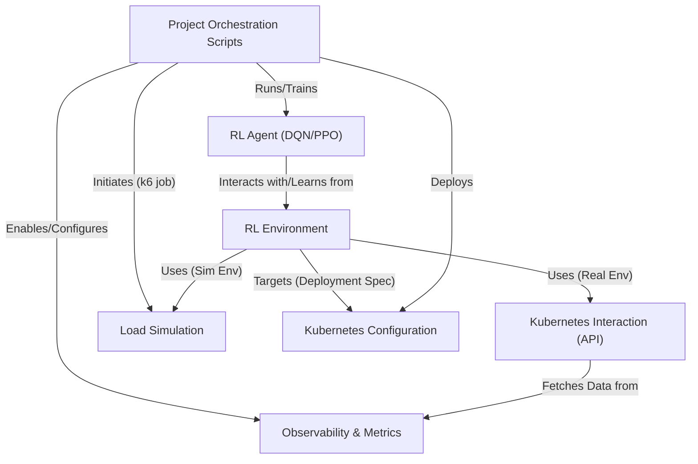

# Tutorial: microk8s-autoscaling

This project implements an **adaptive autoscaling solution** for applications running on a *lightweight Kubernetes cluster* like MicroK8s.
It uses **Reinforcement Learning (RL)** agents (like DQN or PPO) to learn the optimal number of application pods based on real-time cluster metrics (like CPU, memory, and latency).
By replacing traditional autoscalers (like HPA) with an intelligent RL agent, the goal is to achieve better **cost efficiency** and **performance**, validated through monitoring and load simulation.

## Visual Overview

## Chapters

1. [Kubernetes Configuration
](01_kubernetes_configuration_.md)
2. [Observability & Metrics
](02_observability___metrics_.md)
3. [Kubernetes Interaction (API)
](03_kubernetes_interaction__api__.md)
4. [Project Orchestration Scripts
](04_project_orchestration_scripts_.md)
5. [RL Environment
](05_rl_environment_.md)
6. [RL Agent (DQN/PPO)
](06_rl_agent__dqn_ppo__.md)
7. [Load Simulation
](07_load_simulation_.md)

---

Generated by [AI Codebase Knowledge Builder](https://github.com/The-Pocket/Tutorial-Codebase-Knowledge).